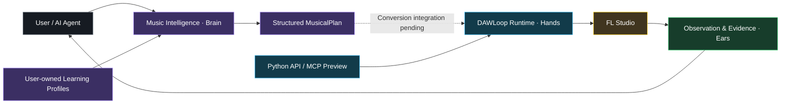

# DAWLoop

**AI agents that understand, plan, operate, observe, and iteratively work inside real DAWs.**

DAWLoop is an experimental music agent runtime. It expresses musical intent as structured plans and connects them to real FL Studio targets through evidence-aware control.

[中文](README.md) | [English](README.en.md)

[](LICENSE)
[](pyproject.toml)
[](docs/ROADMAP.md)
[](https://github.com/ryurikoneko/DAWLoop/releases/tag/v0.2.0-alpha.1)



The diagram shows module relationships. The dashed link marks integration awaiting validation. Iterative production is the project vision; tested capabilities are listed below.

## Why DAWLoop?

- **Structured musical planning** — Section goals, harmony, register, rhythm density and variation become MusicalPlans with phrase, motif, constraint and provenance information.
- **Real FL Studio control** — Prepare existing Patterns and Channels, open a targeted Piano Roll and dispatch a deterministic note batch.
- **User-owned learning** — Each user's agent learns from their own references and maintains private, versioned profiles. Core supplies contracts and learning procedures.
- **Evidence-aware execution** — Track target observation, dispatch budgets, human acceptance, application observation and host completion separately.
- **Agent integration** — A Python runtime and asynchronous MCP preview keep low-level host details behind explicit operation contracts.

### Beyond an MCP wrapper

MCP supplies a tool interface. DAWLoop adds structured musical intent, deterministic rendering, target preparation, one-shot budgets, an acceptance lifecycle, evidence handling and recovery boundaries. Agents can compose workflows around these contracts.

## What works today?

| Capability | Status | Scope |
| --- | --- | --- |
| Pattern / Channel / targeted Piano Roll navigation | **Live tested** | Existing Kick ↔ Clap, observational confirmation |
| End-to-end Native FAST music writing | **Live tested** | Fixed 16-note test plan, human Accept and visual/auditory review |
| Human reports and application observations | **Live tested** | Persistence and actual realtime claim recorded separately |
| MusicalPlan and Learning Framework | **Offline tested** | Generic contracts, deterministic reference generator, synthetic tutorial |
| MIDI / orchestration / audio analysis | **Offline tested** | SMF checks, range helpers, RMS and calibration planning |
| Asynchronous stdio MCP / RunManager | **Preview** | Offline wiring; live path paused on external browser page identity |
| Learning-plan → FAST integration, connection reuse, continuous project writes | **Planned** | Separate integration and certification stages |

DAWLoop separates **execution**, **observation**, and **verification**. See the [evidence model](docs/VERIFICATION.md) and [Runtime V2 record](docs/DAWLOOP_RUNTIME_V2.md#current).

## A tested FAST workflow

```text
Existing target + constrained structured plan
→ Validate the full plan
→ Prepare target and confirm observationally
→ Deterministic render and one native batch dispatch
→ Preview: user reviews and clicks Accept
→ Human report, application observation and host callback
→ COMPLETED_UNVERIFIED, audition and disposable-session recovery
```

This workflow has been exercised end-to-end in FL Studio within the documented test scope. Human Accept is part of its design.

## Quick start: offline first

```bash
git clone https://github.com/ryurikoneko/DAWLoop.git
cd DAWLoop
python -m venv .venv
# Windows: use .venv/Scripts/python.exe
.venv/bin/python -m pip install -e ".[learning]"
.venv/bin/python learning/examples/generic_learning/run.py --output workspace/personal/demo-v1
```

The synthetic exercise creates reference records, extracted features, a report, two profile revisions and a MusicalPlan. It does not start FL or access external material. Use a new output directory each time.

FL integration requires explicit Controller settings, Gopher initialization and a real visual review/evidence channel. See the [deployment guide](docs/DEPLOYMENT.md) and [FL setup](docs/FL_STUDIO_SETUP.md). The maintainer's private test FLP is not distributed.

## Current alpha scope

Live testing used Windows / FL Studio 26.1.6, Pattern 1 / 808 Kick, PPQ 96, bars 5–8, 16 add-only notes, one dispatch, zero retries/fallbacks and human Accept. Each disposable session ends without saving and with baseline verification.

This is a maintainer test scope, not a compatibility guarantee for every environment. FAST completes as `COMPLETED_UNVERIFIED`: producer-side target binding and Native Exact Set are not certified. Native VERIFIED research is frozen; Auto Accept is deferred. Continuous writes in normal projects and connection reuse remain uncertified.

Learning plans use MIDI velocity 1–127; FAST uses normalized velocity. Their automatic conversion/integration still needs separate validation. See the [input contracts](docs/DEPLOYMENT.md#fast-输入).

## Learning framework

The repository provides **Learning Protocol + Schemas + Prompts + Validators**. Users register their own materials, analyze features, compare references, derive generic profiles, validate hard constraints and revise profiles from personal feedback.

Core consumes numeric constraints rather than artist identities. Example profiles illustrate schemas; personal profiles and workspaces remain private. See the [learning workflow](learning/WORKFLOW.md) and [agent prompts](learning/prompts/). Detailed technical guides currently use Chinese.

## MCP preview

Three tools: `fast_write_music(...)` returns a background run/session, `status(run_id)` exposes readiness and progress, and `submit_human_report(...)` links human evidence. RunManager owns idempotency and dispatch budgets.

The goal is **ZERO-AGENT-COMPUTER-USE FAST PATH**: direct tool calls, optional manual Gopher bootstrap once per host session, and human Accept. The live MCP route is paused on an external browser identity dependency. Existing Runtime certifications remain intact. See the [roadmap](docs/ROADMAP.md).

## Engineering and contribution

[CI](.github/workflows/ci.yml) runs offline regression, synthetic Node observer smoke, builds, isolated wheel installation, the learning tutorial and provenance/hash checks. It never starts FL and does not confer live certification.

[Architecture](docs/ARCHITECTURE.md) · [Analysis tools](docs/PRODUCTION_PIPELINE.md) · [Public evidence](evidence/public/README.md) · [Contributing](CONTRIBUTING.md) · [Security](SECURITY.md) · [Release verification](docs/RELEASING.md)

## Attribution and license

Project-owned code, learning contracts, examples and public documentation remain [MIT](LICENSE). [NOTICE](NOTICE), [AUTHORS](AUTHORS), [CITATION.cff](CITATION.cff) and provenance document origin; [license policy](LICENSE_POLICY.md) and [brand rules](TRADEMARKS.md) define their respective scope. No asset is currently separately activated under CC BY-NC.

The bundled backend is a fixed MIT snapshot of [karl-andres/fl-studio-mcp](https://github.com/karl-andres/fl-studio-mcp). Parts of the Production Pipeline adapt MIT `whale-music-pipeline` code. Thanks to [坏影子不坏](https://space.bilibili.com/599132499) for the [DSH workflow demonstrations](https://www.bilibili.com/video/BV1PTht6cENP/). See [third-party notices](THIRD_PARTY_NOTICES.md).

Private references, profiles, Memos, credentials, FLPs and raw live-session evidence are excluded. Official manual HTML/images are not bundled. Historical commits, tags and alpha.1 release assets remain unchanged.
