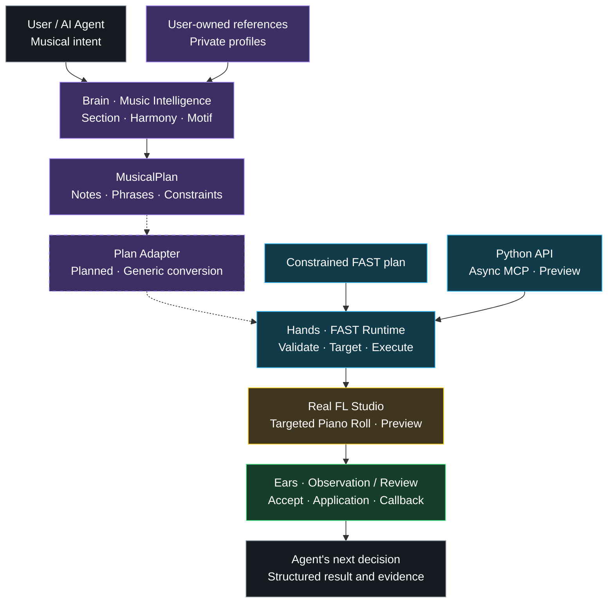

# DAWLoop

**AI agents that understand, plan, operate, observe, and iteratively work inside real DAWs.**

When an agent knows what it wants to write, how does that idea reach the DAW?

DAWLoop is built around that question: turn the idea into a clear plan, find the right Pattern and Channel, write it, observe the result, and choose the next step. A constrained FAST workflow has completed this loop in real FL Studio. Musical learning and agent integration are developing around the same architecture.

[中文](README.md) | [English](README.en.md)

[](LICENSE)
[](pyproject.toml)
[](docs/ROADMAP.md)
[](https://github.com/ryurikoneko/DAWLoop/actions/workflows/ci.yml)
[](https://github.com/ryurikoneko/DAWLoop/releases)

[Quick start](#quick-start) · [Deployment](docs/DEPLOYMENT.md) · [Learning path](learning/WORKFLOW.md) · [Release verification](docs/RELEASING.md) · [Roadmap](docs/ROADMAP.md)



Solid links show existing components and the constrained FAST path. Dashed links mark the **planned generic MusicalPlan → FAST conversion**. MCP is an offline wiring preview; live results currently come from the Python FAST path.

## Why DAWLoop exists

Writing notes is one part of making music. An agent also needs to understand the section, the voice's role, the destination, and what happened in the project after an operation.

DAWLoop brings these questions into one working loop. The music layer expresses the idea, the Runtime handles host operations, and observation and analysis bring results back to the agent. Iterative production is the architectural goal; a constrained writing loop already runs today.

## What you can do with it

- **Describe the task in musical terms.** Organize section goals, harmony, register, density and variation as a MusicalPlan, retaining phrase and motif relationships for later work.
- **Execute plans inside FL Studio.** Prepare existing Patterns and Channels, open a targeted Piano Roll, and send a controlled note plan to Preview for human review and Accept.
- **Let your agent learn your preferences.** Analyze personal references or earlier work and maintain revisable profiles, with private material kept in your own workspace.
- **Observe what happened.** Record target confirmation, human reports, application observations and host completion as separate evidence.
- **Reuse one Runtime.** The Python entrypoint owns the existing FAST workflow; asynchronous MCP and RunManager provide a preview of high-level agent tools.

### What does DAWLoop add beyond an MCP tool interface?

A tool interface lets an agent invoke host actions. A musical workflow also needs plan validation, deterministic rendering, target confirmation, budgets, human acceptance, result observation and recovery.

DAWLoop handles that workflow. The caller decides where to write and what to write; the Runtime organizes the operation and returns its evidence and terminal state. The project separates **execution**, **observation**, and **verification**. See the [evidence model](docs/VERIFICATION.md).

## Brain / Hands / Ears

| Layer | Purpose | Current components |
| --- | --- | --- |
| **Brain — Music and rules** | Turn intent, context and preferences into plans | MusicalPlan, learning contracts, reference generator, deterministic validators |
| **Hands — Host execution** | Prepare targets and perform controlled operations | Controller navigation, Gopher Native FAST, separate Community MCP adapter |
| **Ears — Analysis and observation** | Understand material and support the next decision | MIDI / audio analysis, visual review receipts, HumanReport, application observation and host callback |

The layers serve one loop. Their respective test scopes appear in the capability table below.

## How an agent operation works

Suppose you have an existing Pattern and instrument and want to add a phrase. The tested FAST workflow is:

1. Submit the existing target and a constrained structured plan; validate the whole plan first.
2. Prepare the target and confirm the visible Piano Roll through identity read → fresh visual review → identity read.
3. Render a controlled script deterministically and perform one native batch dispatch.
4. FL shows Preview; the user reviews it and clicks Accept once.
5. Collect the human report, application observation and host callback; return `COMPLETED_UNVERIFIED`.
6. Audition the result, then close the disposable research session without saving and verify its baseline.

In a longer agent workflow, the structured result informs the next decision. Continuous operations in normal projects remain a later stage. See the [current alpha scope](#current-alpha-scope).

## Music Intelligence: preserve musical relationships

A MusicalPlan keeps both the notes and their organization. Section Brief describes the section and energy curve; Harmony Context records key, chords and allowed tensions; Voice and Variation constrain range, leaps, repetition and change.

The output includes `notes[]`, `phrase_map`, `motif_map`, a constraints snapshot and provenance. A request such as “keep the opening motif, but make the second half more active” therefore has context to build on.

The current reference generator is a constrained monophonic, 4/4 offline implementation, limited to eight bars and 16 notes. It exercises contracts and constraints. Users' agents or external generators can also submit plans within the current contract to the same validator. The explicit conversion layer into FAST remains planned. [Music contracts and architecture](docs/ARCHITECTURE.md#音乐合同与学习)

## Real FL Studio Control: reach the Piano Roll

DAWLoop connects to a running FL Studio session. Runtime V2 reads the Controller's runtime identity and prepares existing targets in a fixed sequence:

```text
Select the existing Pattern
→ Exclusively select the Channel by global index
→ Open that Channel's Piano Roll explicitly
→ identity / fresh UI / identity
```

After target confirmation, the Gopher Native backend performs one batch dispatch. FAST owns structured input, source/hash checks, generation guards, budgets and the acceptance lifecycle. An uncertain stage stops the operation.

The maintainer has completed zero-write Kick ↔ Clap navigation and the fixed 16-note human-accepted writing loop. [FL deployment](docs/DEPLOYMENT.md) · [Runtime V2 record](docs/DAWLOOP_RUNTIME_V2.md#current)

## Learning Framework: your agent learns your preferences

**DAWLoop leaves musical preferences with the user.**

Your agent might study earlier projects, compare a group of reference tracks, or record a preference for sparse rhythms and smaller leaps. Core accepts generic constraints; personal learning stays local. You and your agent decide which references and features matter.

The repository supplies a reusable path:

```text
Register references → Extract features → Compare recurring patterns
→ Derive a profile → Validate hard constraints → Generate an offline MusicalPlan
→ User feedback → A new profile revision
```

Underneath are a Learning Protocol, four schemas, agent prompt templates and validators. The user's agent or an external analyzer performs actual feature extraction. Profiles preserve provenance, versions and uncertainty, so a user can keep a reference's rhythm while adjusting its register.

`profiles/examples/` illustrates contracts. `profiles/personal/` and `workspace/personal/` are gitignored, and the public tutorial uses synthetic material. See the [learning path](learning/WORKFLOW.md) and [agent prompts](learning/prompts/). Detailed technical guides currently use Chinese.

## Production & Analysis: more context for the next step

The optional Production Pipeline helps agents inspect existing material and audio:

- **MIDI** — Parse SMF tracks and notes and find note-dense bar windows.
- **Arrangement** — Assign phrases by register, detect range gaps and check for source notes omitted during an arrangement pass.
- **Audio and mix planning** — Measure active-frame RMS and peak in WAV files, then plan fader changes using measured calibration data.
- **Local audio utilities** — Windows WASAPI loopback discovery/capture and SoundFont parsing with offline sample rendering.

These tools return analysis data for decisions. Measurement and suggestions feed the agent; actual DAW operations remain the execution path's responsibility.

```sh
python -m pip install -e ".[production]"
dawloop midi-inspect song.mid --beats-per-bar 4 --window-bars 3
dawloop measure-wav track.wav --frame-ms 100 --floor-dbfs -65
```

Windows loopback uses the optional `[production-loopback]` dependencies. See [Production Pipeline](docs/PRODUCTION_PIPELINE.md) for APIs, environment requirements and provenance.

## Agent Integration: Python and asynchronous MCP

Python's `FastMusicRuntime` owns the controlled FAST transaction. The caller supplies a structured target and plan; the Runtime validates, prepares, dispatches and returns an evidence-rich result.

The asynchronous stdio MCP preview exposes three tools:

| Tool | Responsibility |
| --- | --- |
| `fast_write_music(...)` | Validate the request, create a background run, return `run_id` / `session_id` |
| `status(run_id)` | Report real readiness and progress |
| `submit_human_report(...)` | Bind human evidence to the specified run/session |

RunManager owns operation idempotency and one-shot budgets. The independent observer handles capture and receipt transport; content confirmation still requires real visual review.

The goal is **ZERO-AGENT-COMPUTER-USE FAST PATH**: direct tool calls, optional manual Gopher bootstrap once per host session, and human Accept at Preview. Live MCP wiring is paused on an external browser page-identity dependency. Connection reuse will be tested separately. [MCP deployment and readiness](docs/DEPLOYMENT.md)

### Bundled FL Studio MCP

The repository also retains a pinned MIT snapshot of [karl-andres/fl-studio-mcp](https://github.com/karl-andres/fl-studio-mcp) in `third_party/fl-studio-mcp/`, with a separate DAWLoop adapter in `src/dawloop/adapters/fl_studio_mcp/`.

It underpins the early control path and remains an optional Community backend. Its upstream transport, Mixer, Channel and loaded-plugin parameter capabilities are tracked separately from Runtime V2's Gopher Native FAST. See [FL Studio MCP](docs/FL_STUDIO_MCP.md) for setup and boundaries.

## What works today

| Capability | Status | Scope |
| --- | --- | --- |
| Pattern / Channel / targeted Piano Roll navigation | **Live tested** | Existing Kick ↔ Clap, observational target confirmation |
| Native FAST entrypoint | **Live tested** | Fixed 16-note plan, human Accept, visible result and audition |
| HumanReport, application observation and host completion | **Live tested** | Realtime claims within a one-dispatch loop |
| MusicalPlan and Learning Framework | **Offline tested** | Contracts, reference generator, synthetic learning tutorial |
| MIDI / arrangement / RMS / fader planning | **Offline tested** | Parsing, analysis and planning algorithms |
| WASAPI loopback / SoundFont | **Optional utilities** | Local audio environment and optional dependencies |
| Async stdio MCP / RunManager | **Preview** | Offline wiring passed; live path paused |
| Generic MusicalPlan → FAST Adapter | **Planned** | Explicit field and unit conversion |
| Connection reuse and continuous project writes | **Planned** | Separate lifecycle and budget validation |

## Quick start

### Start with the offline learning tutorial

No FL Studio required. Use Python 3.11 or newer:

```sh
git clone https://github.com/ryurikoneko/DAWLoop.git
cd DAWLoop
python -m venv .venv
# Windows: use .venv/Scripts/python.exe
.venv/bin/python -m pip install -e ".[learning]"
.venv/bin/python learning/examples/generic_learning/run.py --output workspace/personal/demo-v1
```

The tutorial creates reference records, features, a report, two profile revisions and an offline plan without accessing external material. Use a new output directory for each run.

### Then configure FL Studio integration

Follow the [deployment guide](docs/DEPLOYMENT.md) for optional dependencies, the active Controller settings root, Gopher and actual visual review receipts. [FL setup](docs/FL_STUDIO_SETUP.md) covers the bundled Community backend's MIDI configuration; the deployment guide governs Native FAST setup and research entrypoints.

```python
from dawloop.runtime.fast_music import FastMusicRuntime

result = await FastMusicRuntime(backend).execute_fast_music_plan(
    target, musical_plan, operation_id=operation_id,
    acceptance_mode="human", experimental_authorized=True,
)
```

This illustrates the API within a configured integration. The maintainer's private test FLP is not distributed. Start with an independent test project and complete preflight checks.

## Current alpha scope

Live testing used Windows / FL Studio 26.1.6, Pattern 1 / 808 Kick, PPQ 96, bars 5–8, 16 add-only notes, one dispatch, zero retries/fallbacks and human Accept. Audition is part of the workflow; research sessions close without saving and verify their baseline.

FAST returns `COMPLETED_UNVERIFIED`, preserving observational target and application evidence. Producer-side binding and Native Exact Set are uncertified; Native VERIFIED research is frozen. Auto Accept is deferred, and normal-project continuous writing and connection reuse are uncertified. Other environments need independent checks.

Learning plans use MIDI velocity 1–127; FAST uses normalized velocity. Their conversion requires the planned adapter and separate validation. [Input contracts](docs/DEPLOYMENT.md#fast-输入) · [Evidence levels](docs/VERIFICATION.md)

## Architecture, research and contribution

[CI](.github/workflows/ci.yml) covers cross-platform offline regression, synthetic Node observation, builds, isolated wheel installation, the learning tutorial and provenance/hash checks. The signed-tag workflow builds artifacts and verifies attestations. Live evidence is recorded separately.

[Architecture](docs/ARCHITECTURE.md) · [Runtime V2](docs/DAWLOOP_RUNTIME_V2.md#current) · [Public evidence](evidence/public/README.md) · [Roadmap](docs/ROADMAP.md) · [Contributing](CONTRIBUTING.md) · [Security](SECURITY.md) · [Release verification](docs/RELEASING.md)

## Acknowledgements & Prior Art

DAWLoop has a clear community foundation and practical influences.

**[karl-andres/fl-studio-mcp](https://github.com/karl-andres/fl-studio-mcp)** demonstrated a practical route to controlling FL Studio through MCP. It was an important foundation and reference for DAWLoop's earliest control path. The pinned snapshot retains the upstream MIT notice.

**Bilibili creator [坏影子不坏](https://space.bilibili.com/599132499)** directly influenced the Production Pipeline through [DSH videos and workflow demonstrations](https://www.bilibili.com/video/BV1PTht6cENP/): arrangement, MIDI, loopback, active-frame RMS, Mixer calibration and production automation. DSH here refers to those demonstrations.

**`whale-music-pipeline`** supplies code adapted into parts of the Production Pipeline. The project records the maintainer's report of direct reuse permission from the developer. Its source is MIT-licensed, with the original notice in `third_party/whale-music-pipeline/LICENSE`. Generalized modules live in `src/dawloop/production/`; work-specific scores and non-code assets are excluded from Core behavior.

DAWLoop connects musical planning, host execution, result observation and the agent's next decision around these contributions. Creator inspiration, code provenance and licensing are recorded separately in [Acknowledgements](docs/ACKNOWLEDGEMENTS.md), [Production provenance](docs/PRODUCTION_PIPELINE_PROVENANCE.md) and [Third-party notices](THIRD_PARTY_NOTICES.md).

## Project History

The project evolved through **FLSkill → DAWProof → DAWLoop**. FLSkill's public Alpha began with independently testable musical timing and note-event comparison. DAWProof added real control paths and Production utilities. DAWLoop organizes planning, learning, execution and observation into an agent loop.

Historical commits, tags and Releases retain their original names and content. The current Runtime V2 Architecture Preview marks the constrained FAST loop and public engineering foundation. The next product task is the explicit generic MusicalPlan → FAST conversion layer. [Provenance](PROVENANCE.md) · [Release history](https://github.com/ryurikoneko/DAWLoop/releases)

## License and attribution

Project-owned code, learning protocols, examples and public documentation use [MIT](LICENSE). Third-party components retain their copyrights and terms. No asset currently has a separately activated CC BY-NC license. See [license policy](LICENSE_POLICY.md) and [brand rules](TRADEMARKS.md).

[NOTICE](NOTICE), [AUTHORS](AUTHORS), [CITATION.cff](CITATION.cff) and provenance document origin and citation. Private profiles, workspaces, Memos, credentials, FLPs and raw live material are excluded. Official manual HTML/images are not bundled.
