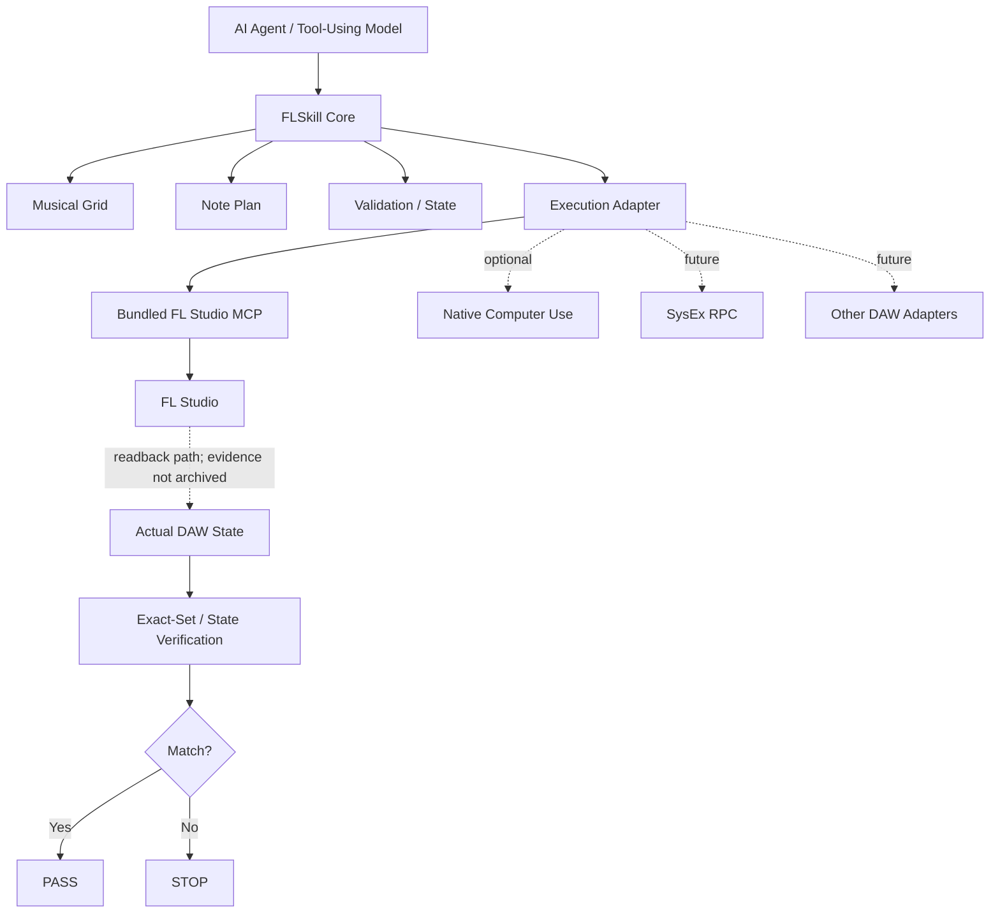

# FLSkill

**Verification-oriented FL Studio automation framework for AI agents.**

**Built for AI agents.**

**Connects to real FL Studio through an experimental integration path.**

**Success requires readback verification—not just a tool saying “done”.**

[](LICENSE)
[](pyproject.toml)
[](docs/ROADMAP.md)

FLSkill connects structured musical plans with execution adapters, DAW state readback, and explicit `PASS` / `STOP` verification. Its central rule is simple: a backend reporting success is not enough; the resulting musical state must be read back and checked.

```text
Plan → Execute → Read Back → Verify → PASS / STOP
```

> **Live integration status:** The maintainer reports completing an FL Studio integration run. The path may still be unstable across setups; real-world user testing and feedback are welcome. This repository does not include archived live readback evidence, so it does not claim a reproducible Live Exact-Set `Verified` result.

FLSkill is an independent project and is not affiliated with, endorsed by, or sponsored by Image-Line or OpenAI.

## Current Status

| Capability | Status |
|---|---|
| Musical Grid, absolute tick resolution, Note Plan | ✅ Verified — offline core |
| Exact-Set Verification and `PASS` / `STOP` | ✅ Verified — offline algorithm |
| AI-agent-oriented interfaces | ✅ Implemented |
| Bundled Community FL Studio MCP snapshot | ✅ Available |
| FL Studio live integration | 🟡 Experimental — maintainer-reported; stability feedback requested |
| Pattern / Channel identity and live note readback | 🚧 In Development — live evidence not archived here |
| Live Exact-Set Verification | 🚧 In Development — no reproducible evidence in this repository |
| Mixer discovery / plugin parameter reads | 🟡 Backend available; FLSkill live verification not claimed |
| Mixer writes / plugin parameter writes | 🗺 Roadmap |
| Multi-pattern / multi-channel composition | 🗺 Roadmap |
| Autonomous song production | 🗺 Roadmap |

`v0.1.0-alpha` remains the original clean offline-core release. The bundled backend and adapter foundation are on the current integration branch; they are not part of that historical release.

## Architecture



A backend response such as “success” is not enough for FLSkill `PASS`. The readback path and verification result must be available as evidence for the specific operation.

## Designed for AI Agents

FLSkill is designed around structured, machine-readable interfaces that AI agents can call, inspect, and verify. It is intended for Codex-style agents, MCP clients, Computer Use agents, tool-using language models, and custom orchestration systems. This is an agent-oriented architecture, not a claim that every agent is already supported.

```text
Agent Plan → Validate → Execute → FL Studio
→ Read Back → Verify → PASS / STOP → Agent chooses next action
```

The agent is never trusted solely because it claims an operation succeeded. On `STOP`, the agent should report the failure and avoid building further actions on an unverified state.

## What FLSkill Gives You

- Deterministic musical timing and structured Note Plans
- A DAW-independent verification core
- An optional, pinned FL Studio MCP execution backend
- An FL Studio integration path, currently experimental
- Explicit separation between write, readback, and verification
- Structured `PASS` / `STOP` reports
- Environment diagnostics and User Script installation commands
- Provenance tracking for project files and bundled third-party code
- An adapter boundary for future execution backends

## Installation

The integration branch is not a published package release. From a local clone:

```powershell
git clone https://github.com/ryurikoneko/FLSkill.git
cd FLSkill
git switch integration/bundled-fl-studio-mcp
python -m pip install -e ".[flstudio]"
flskill doctor
```

To install the bundled upstream User Scripts, pass the actual FL Studio `Settings` directory. Existing destination files are backed up by the installer before replacement:

```powershell
flskill install-fl-scripts --settings-dir "<FL Studio Settings directory>"
```

`flskill doctor` distinguishes installed dependencies and MIDI ports from an actual FL Studio response. To run its read-only connection probe:

```powershell
flskill doctor --probe-fl
```

## Quick Start

For the stable published release, use the [offline Quickstart](docs/QUICKSTART.md). To explore the experimental integration branch:

1. Install the branch and optional FL Studio dependencies using the commands above.
2. Run `flskill doctor` and resolve reported setup issues.
3. Install the User Scripts and enable the bundled controller in FL Studio MIDI settings.
4. Prepare a disposable test project with an existing blank Pattern and a known Channel.
5. Use an external identity reader to confirm the project, Pattern, and Channel before any write.
6. Run a Note Plan through `FLStudioMCPAdapter`; inspect the returned report and readback.
7. Treat `PASS` as operation-specific only when fresh target and event evidence supports it.

The repository does not currently provide a safe, self-contained live test runner or a general command that submits arbitrary Note Plans. See [Live test prerequisites](tests/live_fl/README.md) and [FL Studio MCP integration](docs/FL_STUDIO_MCP.md). Do not use a private song for live testing.

## Live FL Studio Integration

The maintainer reports completing an integration run in a real FL Studio environment and requests feedback because stability may vary. That report is not accompanied by archived target-identity and actual-event evidence in this repository. Accordingly, connection, Pattern / Channel targeting, note write/readback, and Live Exact-Set are not presented here as reproducibly `Verified` capabilities.

The live adapter is designed to check Pattern and Channel identity, confirm a blank target, write through the bundled MCP backend, request a fresh Piano Roll state, and compare planned and actual events. The repository's live-test notes document the current identity-reader prerequisite. Do not interpret backend availability or a maintainer-reported run as proof that every installation can complete this sequence.

## Bundled FL Studio MCP

FLSkill bundles a pinned source snapshot of [karl-andres/fl-studio-mcp](https://github.com/karl-andres/fl-studio-mcp) at commit [`f89f66f8ca00d1f1fc27ed18ae4a9611551f98d0`](https://github.com/karl-andres/fl-studio-mcp/commit/f89f66f8ca00d1f1fc27ed18ae4a9611551f98d0), under its upstream MIT license. The snapshot is in `third_party/fl-studio-mcp/`; FLSkill-specific adapter code is separate under `src/flskill/adapters/fl_studio_mcp/`. Users do not need to download the upstream source separately.

FLSkill does not replace FL Studio MCP. It uses the project as an execution backend and adds musical planning, deterministic timing, readback-oriented verification, recovery boundaries, and agent-oriented orchestration. Upstream capability does not automatically mean FLSkill capability, and an upstream success response does not equal FLSkill `PASS`. See [Acknowledgements](docs/ACKNOWLEDGEMENTS.md) and [Third-Party Notices](THIRD_PARTY_NOTICES.md).

## Why FLSkill Exists

Many DAW automation tools focus on whether a command was sent. FLSkill focuses on whether the intended musical state exists after execution:

> How can an AI prove that the musical operation it intended to perform is what actually happened inside the DAW?

## Acknowledgements & Prior Art

FLSkill's early development was made possible in part by practical experience with the community [FL Studio MCP](https://github.com/karl-andres/fl-studio-mcp) project. We are grateful for the upstream work that enabled experimentation with programmatic FL Studio control. The bundled source remains third-party code with its own MIT license and copyright notices; FLSkill does not claim authorship of it.

See [`docs/ACKNOWLEDGEMENTS.md`](docs/ACKNOWLEDGEMENTS.md) for the pinned commit, role, and scope, and [`PROVENANCE.md`](PROVENANCE.md) for file-level source records.

## Roadmap

- **Completed:** Offline Core, Note Plan, Exact-Set algorithm, bundled MCP snapshot, adapter foundation, package extra, diagnostics, and User Script installer.
- **In Development:** Stable live target identification and reproducible note write/readback evidence; compatibility and stability feedback from real-world use.
- **Planned:** Multi-pattern and multi-channel composition, verified Mixer and plugin operations, SysEx RPC, Native Computer Use adapter, audio analysis, and section-level production.

See [`docs/ROADMAP.md`](docs/ROADMAP.md) for details. Roadmap items are not implemented or verified merely because they are listed.

## Contributing and Safety

Contributions are welcome. Read [`CONTRIBUTING.md`](CONTRIBUTING.md) before opening a Pull Request. Report bugs, feature ideas, and sanitized live-test feedback through the [GitHub issue tracker](https://github.com/ryurikoneko/FLSkill/issues). Never attach private FL Studio projects, commercial samples, credentials, or plugin binaries. See [`SECURITY.md`](SECURITY.md).

## Project Documents

- [Offline Quickstart](docs/QUICKSTART.md)
- [Architecture](docs/ARCHITECTURE.md)
- [Verification rules](docs/VERIFICATION.md)
- [FL Studio MCP integration](docs/FL_STUDIO_MCP.md)
- [Roadmap](docs/ROADMAP.md)
- [Acknowledgements](docs/ACKNOWLEDGEMENTS.md)
- [Third-party notices](THIRD_PARTY_NOTICES.md)
- [Provenance](PROVENANCE.md)
- [Live test prerequisites](tests/live_fl/README.md)

## License

FLSkill is licensed under the [MIT License](LICENSE), Copyright (c) 2026 ryurikoneko. Bundled components retain their separate copyrights and license terms; see [THIRD_PARTY_NOTICES.md](THIRD_PARTY_NOTICES.md).
