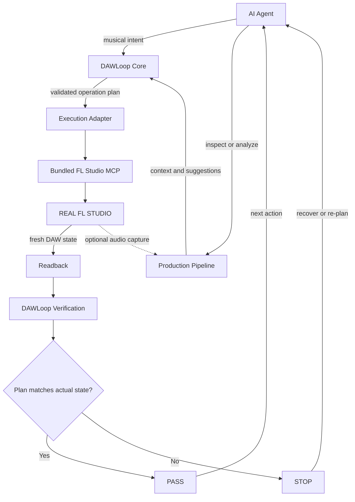

# DAWLoop

**Closed-loop DAW automation framework for AI agents.**

**AI agents can understand, operate, observe, and iteratively work inside real DAWs.**

DAWLoop gives an agent a real execution path into a running FL Studio session through its integrated FL Studio MCP backend. It structures musical operations, reads DAW state back, verifies the result, and lets the agent decide what to do next. This is not limited to generating MIDI for a person to import later.

[](LICENSE)
[](pyproject.toml)
[](docs/ROADMAP.md)

```text
Understand → Analyze → Plan → Execute → Observe → Verify → Iterate
```

Supported DAW-changing operations are designed to be read back and verified before the agent continues.

## Control Real FL Studio

**Can DAWLoop actually control FL Studio? Yes—through its integrated FL Studio execution backend.**

DAWLoop is not limited to generating MIDI files for manual import. An AI agent can use the bundled Community FL Studio MCP backend and DAWLoop adapter to interact with a running FL Studio environment.

The pinned upstream backend provides control paths covering:

- transport operations;
- channel and current Pattern interactions;
- Piano Roll note writing and note-state readback;
- Mixer track state and routing;
- access to parameters on already-loaded plugins.

These are upstream backend capabilities, not DAWLoop live-verification claims. The upstream project documents that it cannot programmatically create new Patterns or load new plugins; prepare those targets in FL Studio.

The maintainer reports successfully completing a DAWLoop integration run in real FL Studio. The path can be unstable across setups, and real-world testing feedback is welcome. The repository does not archive the complete environment, target identity, operation plan, fresh readback, and comparison from that run. This confirms maintainer live use; it does not make the run reproducible or establish `Live Verified` for individual operations.

The backend source is bundled and the DAWLoop adapter is implemented. A backend response such as “success” does not by itself establish a DAWLoop `PASS`.

## Three-Layer Architecture

| Layer | Role |
|---|---|
| **Hands — FL Studio execution backend** | Bundled Community FL Studio MCP and the DAWLoop adapter provide the path for acting on a running FL Studio session. |
| **Brain and Rules — DAWLoop Core** | Structures musical timing and Note Plans, validates targets, separates execution from fresh readback, and verifies planned state against actual state. |
| **Ears / Production Assistance — Production Pipeline** | Inspects MIDI and audio, checks orchestration, measures active-frame RMS, and plans fader changes to help an agent choose what to do next. |

The agent gets both a way to act and rules for proving whether the action actually succeeded.



Production Pipeline analysis helps an agent understand material and choose a next operation. It does not replace execution or verification.

## The Agent Loop

```text
Agent understands the task
        ↓
Production Pipeline analyzes context
        ↓
DAWLoop structures and validates the operation
        ↓
FL Studio MCP executes it in the running DAW
        ↓
DAWLoop reads the resulting state
        ↓
Verification compares actual state with the plan
        ↓
PASS / STOP
        ↓
Agent chooses the next action
```

An agent should not build later operations on a state that returned `STOP` or has not been read back.

## Why DAWLoop

A typical AI music workflow may stop after producing MIDI, JSON, instructions, or a tool success response. DAWLoop is designed to continue through a closed loop:

1. Understand musical intent.
2. Analyze the current context.
3. Structure a DAW operation.
4. Execute it inside the running DAW.
5. Observe the resulting state.
6. Verify it against the plan.
7. Continue or re-plan based on the result.

**Backend success is not DAWLoop PASS.**

**Maintainer Live Tested is not Live Verified.**

## Capability and Evidence Status

Implementation availability and verification evidence are separate. “Backend Available” describes the bundled upstream execution surface; it is not evidence that DAWLoop verified a live operation.

### Core / Planning

| Capability | Implementation | Evidence |
|---|---|---|
| Musical Grid, absolute tick resolution, Note Plan | Implemented | Offline Tested |
| Exact-Set Verification | Implemented | Offline Tested |
| Structured `PASS` / `STOP` results | Implemented | Offline Tested |

### FL Studio Control

| Capability | Implementation | Evidence |
|---|---|---|
| Bundled Community FL Studio MCP snapshot | Backend Available | Upstream source bundled; not a DAWLoop live result |
| FL Studio connection path | Experimental | Maintainer Live Tested; setup may be unstable across environments, and feedback is welcome |
| Transport control | Backend Available | No archived DAWLoop live evidence |
| Pattern identity checks | Implemented; external identity reader required | Live test not established; no archived field-level evidence |
| Channel identity checks | Implemented | Live test not established; no archived field-level evidence |
| Piano Roll note writing | Implemented | Maintainer Live Tested; archived field-level evidence pending |
| Piano Roll note-state readback | Implemented | Maintainer Live Tested; archived field-level evidence pending |
| Live Exact-Set comparison | Experimental | Maintainer live-tested status not established; no archived comparison; not Live Verified |
| Mixer discovery | Implemented in adapter; backend operation available | No archived live evidence |
| Loaded-plugin parameter reads | Implemented in adapter; backend operation available | No archived live evidence |
| Mixer writes / plugin parameter writes | Roadmap | Not DAWLoop-verified |

### Production Analysis

| Capability | Implementation | Evidence |
|---|---|---|
| SMF inspection, dense-window analysis, orchestration checks | Implemented | Offline Tested |
| Active-frame RMS and fader calibration / planning | Implemented | Offline Tested; planning does not verify a DAW change |
| SoundFont inspection / audition utility | Implemented | Offline utility |
| Windows WASAPI loopback capture | Available | Optional; depends on the local audio environment |

### Evidence Terms

- **Offline Tested** means checked with offline tests or synthetic fixtures; it does not establish live DAW behavior.
- **Maintainer Live Tested** records the maintainer's report that an integration path was exercised in real FL Studio. It may be unstable and is not equivalent to reproducible, archived evidence.
- **Archived Live Evidence** means target and readback evidence is preserved in the repository for review.
- **Live Verified** requires actual DAW readback and a passing comparison for the stated capability and target scope.

The live integration run is therefore acknowledged without treating every backend or adapter capability as individually verified. No Mixer fader write/readback loop is marked verified; control verification and audio-outcome verification remain separate phases.

## Installation

The current development build is not yet a published package release. From a source checkout:

```powershell
git clone https://github.com/ryurikoneko/DAWLoop.git
cd DAWLoop
python -m pip install -e ".[flstudio,production]"
dawloop doctor
```

For Windows loopback measurement:

```powershell
python -m pip install -e ".[flstudio,production-loopback]"
```

For the broader Production Pipeline utility set, including Pillow / SciPy dependencies used by related workflows:

```powershell
python -m pip install -e ".[flstudio,production-full]"
```

To install the bundled upstream FL Studio User Scripts, pass the actual FL Studio `Settings` directory. Existing destination files are backed up by the installer before replacement:

```powershell
dawloop install-fl-scripts --settings-dir "<FL Studio Settings directory>"
```

`dawloop doctor` distinguishes installed dependencies and MIDI ports from an actual FL Studio response. To run its read-only connection probe:

```powershell
dawloop doctor --probe-fl
```

### Production analysis commands

`midi-inspect` uses the standard library and does not require NumPy. Install the `production` extra for audio analysis and SoundFont utilities. The doctor reports these features independently and distinguishes the developer-reported working environment from the current machine's portable profile.

```powershell
dawloop midi-inspect song.mid --beats-per-bar 4 --window-bars 3
dawloop measure-wav track.wav --frame-ms 100 --floor-dbfs -65
```

These commands return structured data for an agent. They do not by themselves mark any FL Studio operation as verified.

## Quick Start

For the historical published release, use the [offline Quickstart](docs/QUICKSTART.md). To explore the current integration work:

1. Install the branch and optional dependencies using the commands above.
2. Run `dawloop doctor` and resolve reported setup issues.
3. Optionally inspect a MIDI file with `dawloop midi-inspect` to identify active sections and track structure.
4. Optionally analyze rendered/loopback audio with the active-frame RMS tools.
5. Install the FL Studio User Scripts and enable the bundled controller in FL Studio MIDI settings.
6. Prepare a disposable test project with an existing blank Pattern and a known Channel.
7. Use an external identity reader to confirm the project, Pattern, and Channel before any write.
8. Run a Note Plan through `FLStudioMCPAdapter`; inspect the returned report and readback.
9. Treat `PASS` as operation-specific only when fresh target and event evidence supports it.

The repository does not currently provide a safe, self-contained live test runner or a general command that submits arbitrary Note Plans. See [Live test prerequisites](tests/live_fl/README.md) and [FL Studio MCP integration](docs/FL_STUDIO_MCP.md). Do not use a private song for live testing.

## Production Pipeline

DAWLoop incorporates reusable code and design ideas from the open-source **`whale-music-pipeline`** project. The developer is credited as [坏影子不坏](https://space.bilibili.com/599132499) (Bilibili UID `599132499`). The source code carries an MIT license.

Integrated, generalized capabilities include:

- dependency-free Standard MIDI File inspection and dense-section selection;
- register-aware phrase/instrument selection helpers;
- midrange gap detection and source-note coverage checks for orchestration passes;
- active-frame RMS so sparse tracks are not judged by whole-song silence;
- measured FL Studio fader calibration and calibration-aware fader planning;
- optional Windows WASAPI loopback capture;
- optional SF2 / SoundFont sample rendering for offline auditioning.

This is not a blind dump of one composition into DAWLoop Core. Score-specific harmony, instrumentation, commissioned-work comments, and example music are not treated as universal rules. Generalized modules live under `src/dawloop/production/` with explicit attribution.

See [Production Pipeline](docs/PRODUCTION_PIPELINE.md), [Production Pipeline provenance](docs/PRODUCTION_PIPELINE_PROVENANCE.md), and [Third-Party Notices](THIRD_PARTY_NOTICES.md).

## Bundled FL Studio MCP

DAWLoop bundles a pinned source snapshot of [karl-andres/fl-studio-mcp](https://github.com/karl-andres/fl-studio-mcp) at commit [`f89f66f8ca00d1f1fc27ed18ae4a9611551f98d0`](https://github.com/karl-andres/fl-studio-mcp/commit/f89f66f8ca00d1f1fc27ed18ae4a9611551f98d0), under its upstream MIT license. The snapshot is in `third_party/fl-studio-mcp/`; DAWLoop-specific adapter code is separate under `src/dawloop/adapters/fl_studio_mcp/`. Users do not need to download the upstream source separately.

DAWLoop does not replace FL Studio MCP. It uses the project as an execution backend and adds musical planning, deterministic timing, readback-oriented verification, recovery boundaries, and agent-oriented orchestration. Upstream capability does not automatically mean DAWLoop capability, and an upstream success response does not equal DAWLoop `PASS`.

## Acknowledgements & Prior Art

DAWLoop's development benefits from both the community [FL Studio MCP](https://github.com/karl-andres/fl-studio-mcp) project and the developer-provided `whale-music-pipeline` codebase. The pipeline contributes practical arranging, analysis, loopback-measurement, and mixer-calibration techniques. DAWLoop combines these execution and analysis capabilities with structured planning, readback, verification, and iterative agent decisions.

See [`docs/ACKNOWLEDGEMENTS.md`](docs/ACKNOWLEDGEMENTS.md), [`THIRD_PARTY_NOTICES.md`](THIRD_PARTY_NOTICES.md), [`PROVENANCE.md`](PROVENANCE.md), and [`docs/PRODUCTION_PIPELINE_PROVENANCE.md`](docs/PRODUCTION_PIPELINE_PROVENANCE.md) for source and license boundaries.

## Roadmap

- **Completed:** Offline Core, Note Plan, Exact-Set algorithm, bundled MCP snapshot, adapter foundation, package extras, diagnostics, Production SMF inspection, generalized orchestration checks, active-RMS analysis, fader calibration planning, and SoundFont utility.
- **In Development:** Stable live target identification and reproducible note write/readback evidence; deeper Production Pipeline section-level arrangement and mixer workflows; compatibility feedback from real-world use.
- **Planned:** Multi-pattern and multi-channel composition, verified Mixer and plugin operations, SysEx RPC, Native Computer Use adapter, expanded audio analysis, and section-level autonomous production.

See [`docs/ROADMAP.md`](docs/ROADMAP.md) for details. Roadmap items are not implemented or verified merely because they are listed.

## Contributing and Safety

Contributions are welcome. Read [`CONTRIBUTING.md`](CONTRIBUTING.md) before opening a Pull Request. Report bugs, feature ideas, and sanitized live-test feedback through the [GitHub issue tracker](https://github.com/ryurikoneko/DAWLoop/issues). Never attach private FL Studio projects, commercial samples, credentials, or plugin binaries. See [`SECURITY.md`](SECURITY.md).

## Project Documents

- [Offline Quickstart](docs/QUICKSTART.md)
- [Architecture](docs/ARCHITECTURE.md)
- [Verification rules](docs/VERIFICATION.md)
- [FL Studio MCP integration](docs/FL_STUDIO_MCP.md)
- [Production Pipeline](docs/PRODUCTION_PIPELINE.md)
- [Production Pipeline provenance](docs/PRODUCTION_PIPELINE_PROVENANCE.md)
- [Roadmap](docs/ROADMAP.md)
- [Acknowledgements](docs/ACKNOWLEDGEMENTS.md)
- [Third-party notices](THIRD_PARTY_NOTICES.md)
- [Provenance](PROVENANCE.md)
- [Live test prerequisites](tests/live_fl/README.md)

## Project history

DAWLoop was previously developed under the names FLSkill and DAWProof. The final name reflects the project's broader closed-loop architecture: analysis, planning, DAW execution, observation, verification, and iterative agent control. Historical tags and releases retain the names used at the time.

## License

DAWLoop is licensed under the [MIT License](LICENSE), Copyright (c) 2026 ryurikoneko. Bundled and adapted components retain their separate copyrights and license terms; see [THIRD_PARTY_NOTICES.md](THIRD_PARTY_NOTICES.md).
