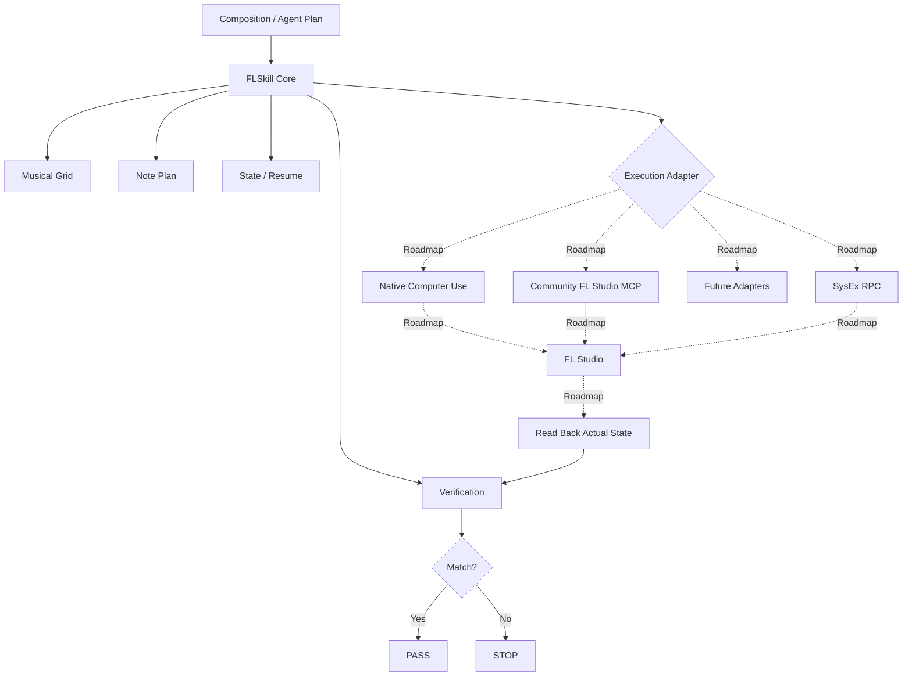

# FLSkill

**状态：** `v0.1.0-alpha`（公开 Alpha 预发布版）  
**核心：** `Offline Algorithm Verified`  
**FL Studio 集成：** 尚未实现

FLSkill 是一个面向 **可验证、可恢复的 AI 音乐制作工作流** 的实验性开源框架。第一阶段先把 DAW 无关的核心做扎实：音乐时间解析、Note Plan、写入/读回边界，以及 Exact-Set Verification。

它关心的不只是“AI 有没有执行操作”，而是：

> **AI 计划做什么，实际系统里最终发生的事情，能不能被重新读回并证明一致。**

```text
Plan → Write → Read Back → Verify → PASS / STOP
```

**核心原则：** `Offline Algorithm Verified ≠ FL Studio Verified`。

> FLSkill 是独立开源项目，与 Image-Line 或 OpenAI 无关联，也未获其认可或赞助。

## 架构



图中真实 DAW 控制与读回流程是目标架构，不代表已实现。当前 `v0.1.0-alpha` 只实现 Core 的离线部分；Native Computer Use、Community FL Studio MCP、SysEx RPC、真实 FL Studio 读回、Mixer 与插件控制仍属 Roadmap。

## 为什么做 FLSkill

很多 AI + DAW 实验的停止条件是“工具调用成功”或“界面看起来改了”。FLSkill 采用更严格的验证边界：

1. 明确计划中的音乐位置与事件。
2. 执行写入。
3. 从目标重新读取实际事件。
4. 对计划集合与实际集合做精确比较。
5. 只有满足验证要求才返回 `PASS`，否则 `STOP`。

Writer 的返回值本身不是成功证据。

## v0.1.0-alpha 包含什么

- **Musical Grid**：PPQ、拍号和一基小节/拍位置。
- **Absolute Tick Resolution**：把音乐位置确定地解析为非负绝对 tick。
- **Note Plan**：目标、段落范围和结构化音符事件。
- **Writer / Reader Protocol**：把执行层与验证核心解耦。
- **In-memory implementation**：仅用于自造离线测试数据。
- **Exact-Set Verification**：保留重复事件数量，检查 missing / extra，并诊断音符字段差异。
- **PASS / STOP semantics**：写入错误、读回错误或计划/实际不一致都必须 STOP。
- **Public provenance tracking**：公开记录当前发布文件的来源边界。

当前核心采用 Python 标准库，无第三方运行依赖。

## 30 秒快速体验

需要 Python 3.11 或更新版本。

```powershell
$env:PYTHONPATH = "$PWD\src"
python -m unittest discover -s tests -v
```

当前发布版包含 14 项离线测试。

最小离线闭环：

```python
from flskill.io import InMemoryEventStore
from flskill.note_plan import NoteEvent, NotePlan
from flskill.time import MusicalGrid
from flskill.verification import write_read_verify

plan = NotePlan(
    target_id="offline-demo",
    grid=MusicalGrid(ppq=480, beats_per_bar=4, beat_unit=4),
    section_start_tick=0,
    section_bars=1,
    events=(
        NoteEvent(start_tick=0, duration=480, pitch=60, velocity=96),
        NoteEvent(start_tick=480, duration=480, pitch=64, velocity=96),
    ),
)

store = InMemoryEventStore()
result = write_read_verify(plan, writer=store, reader=store)

print(result.status)  # PASS
print(result.label)   # Offline Algorithm Verified
```

完整步骤见 [`docs/QUICKSTART.md`](docs/QUICKSTART.md)。

## 示例

- [`examples/note_plan.example.json`](examples/note_plan.example.json)：完全自造的 Note Plan，故意包含重复事件，用来展示验证器会保留事件数量而不是只比较唯一值。
- [`examples/verification_result.example.json`](examples/verification_result.example.json)：示例化展示 `duration` 不一致如何产生 missing / extra / mismatch 并最终 `STOP`。

## 验证边界

当前成功结果只能标记为：

**`Offline Algorithm Verified`**

它不代表 FL Studio 写入已经被验证。未来接入真实适配器后，至少必须确认：

- 目标 Pattern / Channel 身份明确；
- 实际执行写入；
- 从真实目标读回事件；
- 保存读回证据；
- planned / actual 满足对应 Exact-Set 规则。

缺少任一条件，都不能报告 `FL Studio Verified`。

## 计划中的执行路径

未来适配层计划支持或研究：

- Native Computer Use
- Community FL Studio MCP integration
- FLSkill SysEx RPC
- compatibility Computer Use bridge

这些都应作为 **可选 Adapter**，而不是 FLSkill Core 的强制依赖。

## Acknowledgements & Prior Art

FLSkill 的早期实验工作流实际使用并参考了社区项目 [karl-andres/fl-studio-mcp](https://github.com/karl-andres/fl-studio-mcp)，指定参考版本为 [`f89f66f8ca00d1f1fc27ed18ae4a9611551f98d0`](https://github.com/karl-andres/fl-studio-mcp/commit/f89f66f8ca00d1f1fc27ed18ae4a9611551f98d0)，许可证为 MIT。上游项目让我们能够实践 FL Studio 的程序化控制，并帮助我们理解 MCP 驱动的 DAW 自动化。我们感谢这项工作及其作者。

该上游版本的 README 描述了传输控制、Mixer 音量/声像/静音/独奏、Channel 操作与 Mixer 路由、Piano Roll 音符写入和读回，以及对已加载插件参数的查询和设置。上游也明确说明其 API 不能加载新插件或程序化创建 Pattern。以上是上游项目描述的能力，不代表 FLSkill 已集成或验证这些功能。

> FL Studio MCP helped prove that FL Studio could be controlled programmatically; FLSkill is trying to make those operations verifiable.

FLSkill 不打算取代 FL Studio MCP。它是重要的 FL Studio 执行/控制路径；FLSkill 关注围绕音乐规划和确定性时值、Note Plan、写入与读回分离、Exact-Set Verification、恢复续作及状态核验构建编排层。两者互补：控制调用成功本身不等于 FLSkill `PASS`，必须读回实际状态并通过验证。

当前公开 Core 不包含或 vendoring 上游源码。未来 Community FL Studio MCP adapter 是可选集成计划，而不是 Core 依赖。更多信息见 [`docs/ACKNOWLEDGEMENTS.md`](docs/ACKNOWLEDGEMENTS.md) 和 [`docs/ROADMAP.md`](docs/ROADMAP.md)。

## Roadmap

| 阶段 | 目标 | 当前状态 |
|---|---|---|
| `v0.1` | Musical Grid、Note Plan、Exact-Set Verification | ✅ 仅离线算法验证 |
| `v0.2` | 最小 FL Studio adapter，真实写入 + 读回 + 现场验证 | 🚧 计划中 |
| `v0.3` | multi-channel / multi-pattern | 🗺️ Roadmap |
| `v0.4` | SysEx RPC adapter | 🗺️ Roadmap |
| `v0.5` | Mixer / plugin parameter read-write-readback | 🗺️ Roadmap |
| 后续 | Computer Use、社区 MCP、音频分析、section-level composition | 🗺️ Roadmap |

完整路线图见 [`docs/ROADMAP.md`](docs/ROADMAP.md)。

## 当前明确不包含

`v0.1.0-alpha` **尚未提供**：

- live FL Studio control
- SysEx RPC
- Computer Use integration
- community FL Studio MCP adapter
- Mixer control
- plugin parameter control
- autonomous song production

这些能力不会因为出现在 Roadmap 中就被视为已经实现。

## 文档

- [`docs/QUICKSTART.md`](docs/QUICKSTART.md) — 最小离线使用流程
- [`docs/ARCHITECTURE.md`](docs/ARCHITECTURE.md) — 模块与边界
- [`docs/VERIFICATION.md`](docs/VERIFICATION.md) — PASS / STOP 与验证规则
- [`docs/ROADMAP.md`](docs/ROADMAP.md) — 后续阶段
- [`docs/ACKNOWLEDGEMENTS.md`](docs/ACKNOWLEDGEMENTS.md) — 上游项目致谢与关系说明
- [`PROVENANCE.md`](PROVENANCE.md) — 文件来源记录

## License

FLSkill 按 [`MIT License`](LICENSE) 授权。
