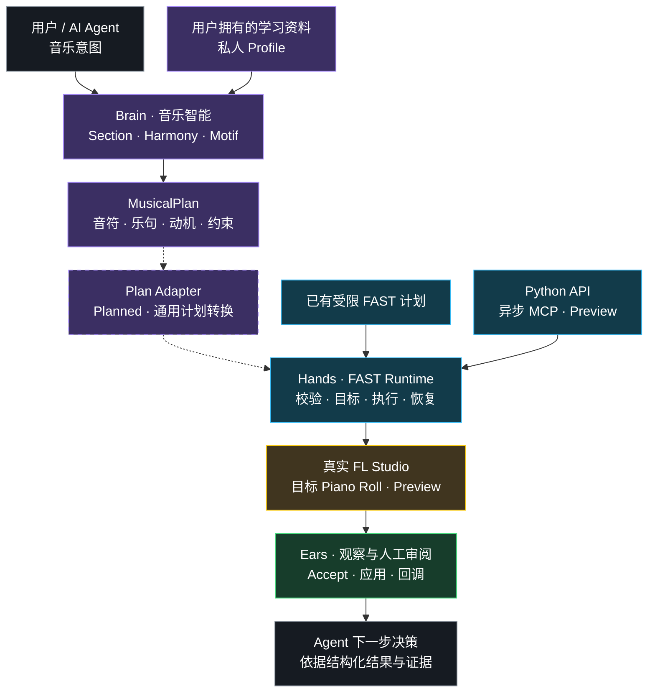

# DAWLoop

**让 AI Agent 理解、规划、操作、观察，并在真实 DAW 中持续创作。**

如果 Agent 已经知道自己想写什么，接下来怎样把这个想法真正放进 DAW？

DAWLoop 围绕这个问题展开：把音乐想法整理成明确的计划，找到正确的 Pattern 和 Channel，完成写入，再观察结果，决定下一步。现在，这个循环已经在真实 FL Studio 的受限 FAST 工作流中跑通；音乐学习与 Agent 接入正在沿着同一条路线发展。

[中文](README.md) | [English](README.en.md)

[](LICENSE)
[](pyproject.toml)
[](docs/ROADMAP.md)
[](https://github.com/ryurikoneko/DAWLoop/actions/workflows/ci.yml)
[](https://github.com/ryurikoneko/DAWLoop/releases)

[快速开始](#快速开始) · [部署](docs/DEPLOYMENT.md) · [学习路径](learning/WORKFLOW.md) · [发布验证](docs/RELEASING.md) · [路线图](docs/ROADMAP.md)



实线展示已有组件和受限 FAST 路径；虚线标出待实现的 **通用 MusicalPlan → FAST 转换**。MCP 为离线接线预览，当前现场结果由 Python FAST 路径取得。

## DAWLoop 为什么存在

写出音符只是音乐制作的一部分。Agent 还要知道这段音乐属于哪个段落、承担什么声部、应该写到哪里，以及操作之后工程里发生了什么。

DAWLoop 把这些问题放进一个共同的工作循环。音乐层表达想法，Runtime 处理宿主操作，观察和分析把结果交回 Agent。持续创作是这套架构的目标；今天已经可以实际运行其中的受限写入闭环。

## 你可以用它做什么

- **用音乐的方式描述任务。** 用段落目标、和弦、音域、密度与变奏约束组织 MusicalPlan，保留乐句和动机关系，方便后续续写。
- **在 FL Studio 里执行计划。** 准备已有 Pattern / Channel，定向进入 Piano Roll，把受控音符计划送到 Preview，由用户审阅并 Accept。
- **让自己的 Agent 学自己的偏好。** 从个人参考素材或历史作品中整理特征，建立可修订的 Profile；私人资料留在自己的工作区。
- **观察操作之后发生了什么。** 分别记录目标确认、人工回执、应用观察和宿主完成，让下一步有可检查的依据。
- **复用同一套 Runtime。** Python 入口封装已实现的 FAST 流程；异步 MCP 与 RunManager 正在把它接成 Agent 的高层工具。

### 在 MCP 工具之外，DAWLoop 做什么？

一个工具接口可以让 Agent 调用宿主动作。一段音乐工作流还需要计划校验、确定性渲染、目标确认、派发预算、人工接受、结果观察和恢复。

这些是 DAWLoop 的工作。上层负责“写到哪里、写什么”，Runtime 负责组织这一轮执行，并把证据和终态返回。项目始终分开 **execution、observation、verification**；具体含义见[证据模型](docs/VERIFICATION.md)。

## Brain / Hands / Ears：三层协作

| 层 | 做什么 | 当前实现 |
| --- | --- | --- |
| **Brain — 音乐与规则** | 把意图、上下文和偏好整理成计划 | MusicalPlan、学习合同、参考生成器、确定性验证器 |
| **Hands — 宿主执行** | 准备目标，执行受控操作 | Controller 导航、Gopher Native FAST、独立的 Community MCP adapter |
| **Ears — 分析与观察** | 理解素材，观察操作结果，支持下一步决策 | MIDI / 音频分析、视觉审阅回执、HumanReport、应用观察和宿主回调 |

三层围绕同一个循环协作；它们各自的测试范围在下方能力表中列出。

## 一轮 Agent 工作怎样完成

假设你已经有一个 Pattern 和乐器，想给它补一段音符。当前已通过的 FAST 工作流是：

1. 提交已有目标与受限结构化计划，先校验整份计划。
2. Runtime 导航到目标，使用身份读取 → 新鲜界面审阅 → 身份读取确认可见 Piano Roll。
3. 确定性 renderer 生成受控脚本，进行唯一一次 Native batch dispatch。
4. FL 显示 Preview；用户审阅后点击一次 Accept。
5. Runtime 收集人工回执、应用观察和宿主完成回调，返回 `COMPLETED_UNVERIFIED`。
6. 用户试听；研究会话不保存退出，并核验基线。

在更长的 Agent 工作中，结构化结果会成为下一次决策的输入。连续作品工程操作仍是后续阶段；本轮闭环的现场范围见[当前 Alpha 范围](#当前-alpha-范围)。

## Music Intelligence：计划里保留音乐关系

MusicalPlan 保存音符，也保存音符之间的组织关系。Section Brief 描述段落与能量变化；Harmony Context 描述调性、和弦和可用张力；Voice 与 Variation 约束音域、跳进、重复和变奏。

输出包含 `notes[]`、`phrase_map`、`motif_map`、约束快照和 provenance。这样一句“后半段沿用前面的动机，但更活跃”就有可延续的上下文。

当前参考生成器是受限单声部、4/4、最多 8 小节和 16-note 的离线实现，用来检验合同与约束。用户的 Agent 或外部生成器也可以提交符合当前合同的计划，交给同一套验证器检查。通用计划接入 FAST 的显式转换层仍待实现。[音乐合同与架构](docs/ARCHITECTURE.md#音乐合同与学习)

## Real FL Studio Control：从计划走到 Piano Roll

DAWLoop 的执行路径连接正在运行的 FL Studio。Runtime V2 使用 Controller 读取运行时身份，并按固定顺序准备目标：

```text
选择已有 Pattern
→ 独占选择目标 Channel（global index）
→ 定向打开该 Channel 的 Piano Roll
→ identity / fresh UI / identity
```

完成目标确认后，Gopher Native backend 负责一次批量派发。整条 FAST 路径统一管理结构化输入、脚本来源与 hash、代次约束、预算和人工接受生命周期。任一步无法确认就停止，避免把不确定状态带到下一次写入。

维护者已完成 Kick ↔ Clap 的零写入导航，以及固定 16-note 的人工接受写入闭环。[FL 部署](docs/DEPLOYMENT.md) · [Runtime V2 记录](docs/DAWLOOP_RUNTIME_V2.md#current)

## Learning Framework：让用户自己的 Agent 学习

**DAWLoop 把音乐偏好的决定权留给用户。**

你可以让 Agent 学自己的旧作品、比较一组参考曲，或者只记录“节奏更稀疏，少大跳”。公共 Core 接收通用约束，个人学习资料放在本地：学谁、喜欢什么、哪些特征应该保留，由你和自己的 Agent 决定。

仓库提供一条可复用的路径：

```text
登记参考素材 → 分析特征 → 比较稳定共性
→ 派生 Profile → 硬约束验证 → 生成离线 MusicalPlan
→ 用户反馈 → 新版 Profile
```

底下是 Learning Protocol、四份 Schema、Agent 提示模板和验证器。用户的 Agent 或外部分析器负责实际特征提取；Profile 带有来源、版本和不确定性，方便保留喜欢的节奏，同时调整不合适的音域。

`profiles/examples/` 用于说明数据合同。`profiles/personal/` 与 `workspace/personal/` 被 Git 忽略；公共教程全部使用合成素材。[八步学习路径](learning/WORKFLOW.md#八步学习路径) · [分析与派生提示词](learning/prompts/)

## Production & Analysis：给下一步更多音乐上下文

可选 Production Pipeline 帮助 Agent 检查已有素材和音频：

- **MIDI**：解析 SMF，查看轨道与音符，寻找音符密集的小节窗口。
- **编排**：按音域分配乐句，检测音域空隙，检查源音符是否在编排处理中遗漏。
- **音频与混音计划**：测量 WAV 的 active-frame RMS 和 peak，依据实测 fader 标定生成调整计划。
- **本机音频辅助**：Windows WASAPI loopback 设备发现与采集，以及 SoundFont 解析和离线 sample rendering。

这些工具返回可用于决策的分析数据。它们与 Runtime 的操作证据分工明确：测量和建议交给 Agent，实际 DAW 操作由执行路径处理。

```powershell
python -m pip install -e ".[production]"
dawloop midi-inspect song.mid --beats-per-bar 4 --window-bars 3
dawloop measure-wav track.wav --frame-ms 100 --floor-dbfs -65
```

Windows loopback 使用 `[production-loopback]` 可选依赖。详细 API、环境要求和来源见 [Production Pipeline](docs/PRODUCTION_PIPELINE.md)。

## Agent Integration：Python 与异步 MCP

Python 的 `FastMusicRuntime` 拥有整轮受控 FAST 事务。调用方提交结构化目标和计划，Runtime 校验、准备、派发并返回带证据的结果。

异步 stdio MCP Preview 保持三个高层工具：

| 工具 | 职责 |
| --- | --- |
| `fast_write_music(...)` | 校验请求，创建后台 run，返回 `run_id` / `session_id` |
| `status(run_id)` | 查询实际 readiness 与运行阶段 |
| `submit_human_report(...)` | 将人工回执绑定到指定 run/session |

RunManager 管理 operation 幂等身份和一次派发预算。独立 observer 负责采样与回执运输，内容判断继续使用真实视觉审阅。

这条路线的目标是 **ZERO-AGENT-COMPUTER-USE FAST PATH**：Agent 直接调工具，用户在必要时每个宿主会话打开一次 Gopher，然后只在 Preview 处人工 Accept。MCP 现场接线目前暂停于外部浏览器页面身份依赖；连接复用在后续单独验证。[MCP 部署与 readiness](docs/DEPLOYMENT.md)

### Bundled FL Studio MCP

仓库还保留 [karl-andres/fl-studio-mcp](https://github.com/karl-andres/fl-studio-mcp) 的固定 MIT 快照，位于 `third_party/fl-studio-mcp/`；DAWLoop adapter 独立位于 `src/dawloop/adapters/fl_studio_mcp/`。

它是早期控制路径的基础，也是可选 Community backend。其 transport、Mixer、Channel、已加载插件参数等上游能力与 Runtime V2 的 Gopher Native FAST 分开登记；详细配置和边界见 [FL Studio MCP](docs/FL_STUDIO_MCP.md)。

## 今天有哪些能力已经通过测试

| 能力 | 状态 | 范围 |
| --- | --- | --- |
| Pattern / Channel / targeted Piano Roll 导航 | **Live tested** | 既有 Kick ↔ Clap，观察性目标确认 |
| Native FAST 高层入口 | **Live tested** | 固定 16-note，人工 Accept，可见结果与试听 |
| HumanReport、应用观察与宿主完成 | **Live tested** | 实时领取、单次派发闭环 |
| MusicalPlan、Learning Framework | **Offline tested** | 合同、参考生成器与合成学习教程 |
| MIDI / 编排 / RMS / fader planning | **Offline tested** | 解析、分析和计划算法 |
| WASAPI loopback / SoundFont | **Optional utilities** | 依赖本机音频环境与可选组件 |
| 异步 stdio MCP / RunManager | **Preview** | 离线接线通过，现场路径暂停 |
| 通用 MusicalPlan → FAST Adapter | **Planned** | 字段与单位的显式转换 |
| 连接复用、普通作品工程连续写入 | **Planned** | 独立生命周期与预算验收 |

## 快速开始

### 先跑离线学习教程

无需 FL Studio。需要 Python 3.11 或更新版本：

```powershell
git clone https://github.com/ryurikoneko/DAWLoop.git
cd DAWLoop
python -m venv .venv
.\.venv\Scripts\python.exe -m pip install -e ".[learning]"
.\.venv\Scripts\python.exe learning/examples/generic_learning/run.py --output workspace/personal/demo-v1
```

Linux/macOS 使用 `.venv/bin/python`。教程生成参考登记、特征、学习报告、两版 Profile 和离线计划，不访问外部素材。再次运行使用新的输出目录。

### 再配置 FL Studio 集成

按[部署指南](docs/DEPLOYMENT.md)配置可选依赖、活动 Controller Settings 目录、Gopher 与真实观察回执。[FL 设置指南](docs/FL_STUDIO_SETUP.md)说明 bundled Community backend 的 MIDI 配置；Native FAST 的配置与研究入口以部署指南为准。

```python
from dawloop.runtime.fast_music import FastMusicRuntime

# backend 来自部署指南中的受审集成配置。
result = await FastMusicRuntime(backend).execute_fast_music_plan(
    target, musical_plan, operation_id=operation_id,
    acceptance_mode="human", experimental_authorized=True,
)
```

这是已配置集成中的 API 用法。维护者测试 FLP 不随包分发；首次接入应使用独立测试工程并完成前置检查。

## 当前 Alpha 范围

现场测试采用 Windows / FL Studio 26.1.6、已有 Pattern 1 / 808 Kick、PPQ 96、第 5–8 小节、16 notes、add-only、一次派发、零重试与 fallback。人工 Accept 和试听属于正式流程；研究会话不保存退出后核验基线。

FAST 返回 `COMPLETED_UNVERIFIED`。它记录观察性目标确认与应用结果，producer 内部绑定和 Native Exact Set 尚未认证；Native VERIFIED 研究冻结。Auto Accept 延期，普通作品工程持续写入和连接复用尚未认证。其他环境需要独立确认。

学习 MusicalPlan 使用 MIDI velocity 1–127，FAST 输入使用 normalized velocity；两套合同之间的转换需要 Plan Adapter 和独立验证。[完整输入合同](docs/DEPLOYMENT.md#fast-输入) · [证据等级](docs/VERIFICATION.md)

## 架构、研究与贡献

[CI](.github/workflows/ci.yml)覆盖跨平台离线回归、Node 合成观察、构建、隔离 wheel 安装、学习教程和 provenance/hash 校验。签名 tag 发布流程构建产物并验证 artifact attestation；现场证据另行记录。

[架构](docs/ARCHITECTURE.md) · [Runtime V2 进度](docs/DAWLOOP_RUNTIME_V2.md#current) · [脱敏证据](evidence/public/README.md) · [路线图](docs/ROADMAP.md) · [贡献](CONTRIBUTING.md) · [安全](SECURITY.md) · [发布验证](docs/RELEASING.md)

## Acknowledgements & Prior Art

DAWLoop 的发展有明确的社区基础和实践来源。

**[karl-andres/fl-studio-mcp](https://github.com/karl-andres/fl-studio-mcp)** 展示了通过 MCP 控制 FL Studio 的可行路径，也是 DAWLoop 最早期控制实现的重要基础和参考。仓库保留其固定快照与原始 MIT 声明。

**Bilibili 创作者[坏影子不坏](https://space.bilibili.com/599132499)** 的 [DSH 视频与制作工作流展示](https://www.bilibili.com/video/BV1PTht6cENP/)直接启发了 Production Pipeline 对编排、MIDI、loopback、active-frame RMS、Mixer 标定和流程自动化的处理。这里的 DSH 指视频与工作流展示。

**`whale-music-pipeline`** 是部分 Production 实现的代码来源。项目记录了维护者收到开发者直接复用许可的说明；源代码为 MIT，原始声明保存在 `third_party/whale-music-pipeline/LICENSE`。泛化后的模块进入 `src/dawloop/production/`，作品专用乐谱与非代码素材没有作为 Core 行为收录。

DAWLoop 在这些工作之上连接音乐计划、宿主执行、观察结果和 Agent 的下一步决策。创作者启发、代码来源与许可关系分别记录在[完整致谢](docs/ACKNOWLEDGEMENTS.md)、[Production 来源](docs/PRODUCTION_PIPELINE_PROVENANCE.md)和[第三方声明](THIRD_PARTY_NOTICES.md)中。

## Project History

项目名称从 **FLSkill → DAWProof → DAWLoop** 演进。FLSkill 的公开 Alpha 起点是可独立测试的音乐时间与音符事件比较核心；DAWProof 阶段加入实际控制路径和 Production 工具；DAWLoop 将音乐计划、学习、执行与观察组织为 Agent 工作循环。

历史提交、标签与 Release 保留当时的名称和内容。当前 Runtime V2 Architecture Preview 标志着受限 FAST 闭环与公共工程化基础形成，下一项产品工作是通用 MusicalPlan → FAST 的明确转换层。[项目来源记录](PROVENANCE.md) · [历史 Releases](https://github.com/ryurikoneko/DAWLoop/releases)

## 许可与归属

自有代码、学习协议、示例和公开文档使用 [MIT](LICENSE)。第三方组件保留各自版权与许可；当前没有单独启用 CC BY-NC 资产。[许可政策](LICENSE_POLICY.md)与[品牌规则](TRADEMARKS.md)说明适用范围。

[NOTICE](NOTICE)、[AUTHORS](AUTHORS)、[CITATION.cff](CITATION.cff) 和 provenance 记录项目来源与引用方式。个人 Profile、workspace、Memos、凭据、FLP 和原始现场材料不发布；官方手册 HTML / 图片未收录。
