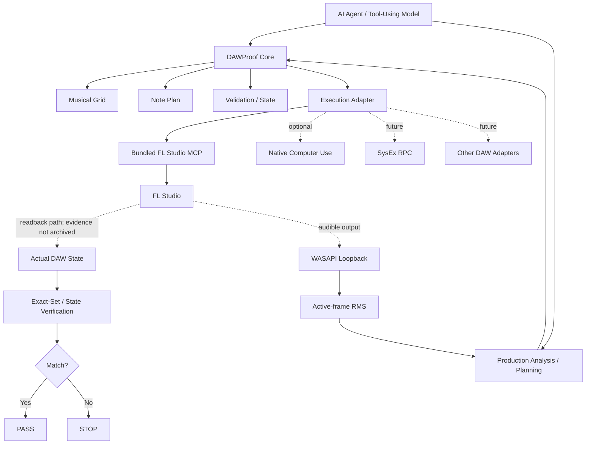

# DAWProof

**Verification-oriented DAW automation framework for AI agents.**

**Built for AI agents.**  
**Connects to real FL Studio through an experimental integration path.**  
**Success requires readback verification—not just a tool saying “done”.**

[](LICENSE)
[](pyproject.toml)
[](docs/ROADMAP.md)

DAWProof connects structured musical plans with execution adapters, DAW state readback, and explicit `PASS` / `STOP` verification. Its central rule is simple: a backend reporting success is not enough; the resulting musical state must be read back and checked.

```text
Plan → Execute → Read Back → Verify → PASS / STOP
```

> **Live integration status:** The maintainer reports completing an FL Studio integration run. The path may still be unstable across setups; real-world user testing and feedback are welcome. This repository does not include archived live readback evidence, so it does not claim a reproducible Live Exact-Set `Verified` result.

DAWProof is an independent project and is not affiliated with, endorsed by, or sponsored by Image-Line, OpenAI, or the developers of bundled/adapted third-party projects.

## Current Status

**DAWProof is a DAW automation framework, not a DAW or music generator, and more than an MCP wrapper.** FL Studio is the primary integration target today.


| Capability | Status |
|---|---|
| Musical Grid, absolute tick resolution, Note Plan | ✅ Verified — offline core |
| Exact-Set Verification and `PASS` / `STOP` | ✅ Verified — offline algorithm |
| AI-agent-oriented interfaces | ✅ Implemented |
| Bundled Community FL Studio MCP snapshot | ✅ Available |
| Production SMF inspection / dense-window analysis | ✅ Implemented — offline tested |
| Production orchestration checks: register assignment / gap / source coverage | ✅ Implemented — offline tested |
| Production active-frame RMS / calibration-aware fader planning | ✅ Implemented — planning/analysis only |
| Production environment profile | ✅ Implemented — local probes; not a compatibility certification |
| Production SoundFont utility | ✅ Implemented — optional offline utility |
| Windows WASAPI loopback capture | 🟡 Available — optional, hardware/environment dependent |
| FL Studio live integration | 🟡 Experimental — maintainer-reported; stability feedback requested |
| Pattern / Channel identity and live note readback | 🚧 In Development — live evidence not archived here |
| Live Exact-Set Verification | 🚧 In Development — no reproducible evidence in this repository |
| Mixer discovery / plugin parameter reads | 🟡 Backend available; DAWProof live verification not claimed |
| Mixer writes / plugin parameter writes | 🗺 Roadmap |
| Multi-pattern / multi-channel composition | 🗺 Roadmap |
| Autonomous song production | 🗺 Roadmap |

`v0.1.0-alpha` remains the original clean offline-core release. The bundled FL Studio backend and Production Pipeline integration are development work and are not part of that historical release.

## Architecture

DAWProof separates planning, production analysis, execution adapters, readback, and verification. The core is designed to be DAW-independent; FL Studio is currently the primary integration target.




A backend response such as “success” is not enough for DAWProof `PASS`. Production analysis can propose the next arrangement or mixer move, but any DAW-changing operation still requires actual readback evidence.

## Designed for AI Agents

DAWProof is designed around structured, machine-readable interfaces that AI agents can call, inspect, and verify. It is intended for Codex-style agents, MCP clients, Computer Use agents, tool-using language models, and custom orchestration systems. This is an agent-oriented architecture, not a claim that every agent is already supported.

```text
Agent Plan → Validate → Execute → FL Studio
→ Read Back → Verify → PASS / STOP → Agent chooses next action
```

The agent is never trusted solely because it claims an operation succeeded. On `STOP`, the agent should report the failure and avoid building further actions on an unverified state.

## Production Pipeline

DAWProof incorporates reusable code and design ideas from the open-source **`whale-music-pipeline`** project. The developer is credited as [坏影子不坏](https://space.bilibili.com/599132499) (Bilibili UID `599132499`). The DAWProof maintainer reports receiving the developer's direct permission to reuse the code; the source code also carries an MIT license.

Integrated, generalized capabilities include:

- dependency-free Standard MIDI File inspection and dense-section selection;
- register-aware phrase/instrument selection helpers;
- midrange gap detection and source-note coverage checks for orchestration passes;
- active-frame RMS so sparse tracks are not judged by whole-song silence;
- measured FL Studio fader calibration and calibration-aware fader planning;
- optional Windows WASAPI loopback capture;
- optional SF2 / SoundFont sample rendering for offline auditioning.

This is not a blind dump of one composition into DAWProof Core. Score-specific harmony, instrumentation, commissioned-work comments, and example music are not treated as universal rules. Generalized modules live under `src/dawproof/production/` with explicit attribution.

See [Production Pipeline](docs/PRODUCTION_PIPELINE.md), [Production Pipeline provenance](docs/PRODUCTION_PIPELINE_PROVENANCE.md), and [Third-Party Notices](THIRD_PARTY_NOTICES.md).

## What DAWProof Gives You

- Deterministic musical timing and structured Note Plans
- A DAW-independent verification core
- An optional, pinned FL Studio MCP execution backend
- Agent-readable MIDI / orchestration / loudness analysis
- Calibration-aware mixer planning based on measured fader behavior
- Optional WASAPI loopback and SoundFont audition utilities
- Explicit separation between write, readback, and verification
- Structured `PASS` / `STOP` reports
- Environment diagnostics and User Script installation commands
- Provenance tracking for project files and adapted/bundled third-party code
- An adapter boundary for future execution backends

## Installation

The current development build is not yet a published package release. From a source checkout:

```powershell
git clone https://github.com/ryurikoneko/DAWProof.git
cd DAWProof
python -m pip install -e ".[flstudio,production]"
dawproof doctor
```

For Windows loopback measurement:

```powershell
python -m pip install -e ".[flstudio,production-loopback]"
```

For the broader Production Pipeline utility set, including Pillow / SciPy dependencies used by related workflows:

```powershell
python -m pip install -e ".[flstudio,production-full]"
```

To install the bundled upstream FL Studio User Scripts, pass the actual FL Studio `Settings` directory. Existing destination files are backed up by the installer before replacement:

```powershell
dawproof install-fl-scripts --settings-dir "<FL Studio Settings directory>"
```

`dawproof doctor` distinguishes installed dependencies and MIDI ports from an actual FL Studio response. To run its read-only connection probe:

```powershell
dawproof doctor --probe-fl
```

### Production analysis commands

`midi-inspect` uses the standard library and does not require NumPy. Install the `production` extra for audio analysis and SoundFont utilities. The doctor reports these features independently and distinguishes the developer-reported working environment from the current machine's portable profile.

```powershell
dawproof midi-inspect song.mid --beats-per-bar 4 --window-bars 3
dawproof measure-wav track.wav --frame-ms 100 --floor-dbfs -65
```

These commands return structured data for an agent. They do not by themselves mark any FL Studio operation as verified.

## Quick Start

For the historical published release, use the [offline Quickstart](docs/QUICKSTART.md). To explore the current integration work:

1. Install the branch and optional dependencies using the commands above.
2. Run `dawproof doctor` and resolve reported setup issues.
3. Optionally inspect a MIDI file with `dawproof midi-inspect` to identify active sections and track structure.
4. Optionally analyze rendered/loopback audio with the active-frame RMS tools.
5. Install the FL Studio User Scripts and enable the bundled controller in FL Studio MIDI settings.
6. Prepare a disposable test project with an existing blank Pattern and a known Channel.
7. Use an external identity reader to confirm the project, Pattern, and Channel before any write.
8. Run a Note Plan through `FLStudioMCPAdapter`; inspect the returned report and readback.
9. Treat `PASS` as operation-specific only when fresh target and event evidence supports it.

The repository does not currently provide a safe, self-contained live test runner or a general command that submits arbitrary Note Plans. See [Live test prerequisites](tests/live_fl/README.md) and [FL Studio MCP integration](docs/FL_STUDIO_MCP.md). Do not use a private song for live testing.

## Live FL Studio Integration

The maintainer reports completing an integration run in a real FL Studio environment and requests feedback because stability may vary. That report is not accompanied by archived target-identity and actual-event evidence in this repository. Accordingly, connection, Pattern / Channel targeting, note write/readback, Mixer write/readback, and Live Exact-Set are not presented here as reproducibly `Verified` capabilities.

The live adapter is designed to check Pattern and Channel identity, confirm a blank target, write through the bundled MCP backend, request a fresh Piano Roll state, and compare planned and actual events. Production Pipeline mixer calibration and loopback analysis add evidence for choosing a next mixer move, but do not weaken this readback requirement.

## Bundled FL Studio MCP

DAWProof bundles a pinned source snapshot of [karl-andres/fl-studio-mcp](https://github.com/karl-andres/fl-studio-mcp) at commit [`f89f66f8ca00d1f1fc27ed18ae4a9611551f98d0`](https://github.com/karl-andres/fl-studio-mcp/commit/f89f66f8ca00d1f1fc27ed18ae4a9611551f98d0), under its upstream MIT license. The snapshot is in `third_party/fl-studio-mcp/`; DAWProof-specific adapter code is separate under `src/dawproof/adapters/fl_studio_mcp/`. Users do not need to download the upstream source separately.

DAWProof does not replace FL Studio MCP. It uses the project as an execution backend and adds musical planning, deterministic timing, readback-oriented verification, recovery boundaries, and agent-oriented orchestration. Upstream capability does not automatically mean DAWProof capability, and an upstream success response does not equal DAWProof `PASS`.

## Why DAWProof Exists

Many DAW automation tools focus on whether a command was sent. DAWProof focuses on whether the intended musical state exists after execution:

> How can an AI prove that the musical operation it intended to perform is what actually happened inside the DAW?

## Acknowledgements & Prior Art

DAWProof's development benefits from both the community [FL Studio MCP](https://github.com/karl-andres/fl-studio-mcp) project and the developer-provided `whale-music-pipeline` codebase. The pipeline contributes practical arranging, analysis, loopback-measurement, and mixer-calibration techniques. DAWProof adds its verification-oriented orchestration layer around these ideas and implementations.

See [`docs/ACKNOWLEDGEMENTS.md`](docs/ACKNOWLEDGEMENTS.md), [`THIRD_PARTY_NOTICES.md`](THIRD_PARTY_NOTICES.md), [`PROVENANCE.md`](PROVENANCE.md), and [`docs/PRODUCTION_PIPELINE_PROVENANCE.md`](docs/PRODUCTION_PIPELINE_PROVENANCE.md) for source and license boundaries.

## Roadmap

- **Completed:** Offline Core, Note Plan, Exact-Set algorithm, bundled MCP snapshot, adapter foundation, package extras, diagnostics, Production SMF inspection, generalized orchestration checks, active-RMS analysis, fader calibration planning, and SoundFont utility.
- **In Development:** Stable live target identification and reproducible note write/readback evidence; deeper Production Pipeline section-level arrangement and mixer workflows; compatibility feedback from real-world use.
- **Planned:** Multi-pattern and multi-channel composition, verified Mixer and plugin operations, SysEx RPC, Native Computer Use adapter, expanded audio analysis, and section-level autonomous production.

See [`docs/ROADMAP.md`](docs/ROADMAP.md) for details. Roadmap items are not implemented or verified merely because they are listed.

## Contributing and Safety

Contributions are welcome. Read [`CONTRIBUTING.md`](CONTRIBUTING.md) before opening a Pull Request. Report bugs, feature ideas, and sanitized live-test feedback through the [GitHub issue tracker](https://github.com/ryurikoneko/DAWProof/issues). Never attach private FL Studio projects, commercial samples, credentials, or plugin binaries. See [`SECURITY.md`](SECURITY.md).

## Project Documents

- [Offline Quickstart](docs/QUICKSTART.md)
- [Architecture](docs/ARCHITECTURE.md)
- [Verification rules](docs/VERIFICATION.md)
- [FL Studio MCP integration](docs/FL_STUDIO_MCP.md)
- [Production Pipeline](docs/PRODUCTION_PIPELINE.md)
- [Production Pipeline provenance](docs/PRODUCTION_PIPELINE_PROVENANCE.md)
- [Roadmap](docs/ROADMAP.md)
- [Acknowledgements](docs/ACKNOWLEDGEMENTS.md)
- [Third-party notices](THIRD_PARTY_NOTICES.md)
- [Provenance](PROVENANCE.md)
- [Live test prerequisites](tests/live_fl/README.md)

## Project rename

DAWProof was previously developed under the name FLSkill. The rename reflects the project’s evolution from an experimental skill concept into a verification-oriented DAW automation framework. Historical tags and release records retain the name used at the time.

## License

DAWProof is licensed under the [MIT License](LICENSE), Copyright (c) 2026 ryurikoneko. Bundled and adapted components retain their separate copyrights and license terms; see [THIRD_PARTY_NOTICES.md](THIRD_PARTY_NOTICES.md).
