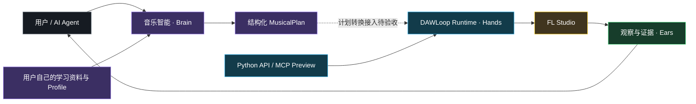

# DAWLoop

**让 AI Agent 理解、规划、操作、观察，并在真实 DAW 中持续创作。**

DAWLoop 是面向音乐 Agent 的实验性运行时：用结构化计划表达音乐，用目标准备和证据链连接真实 FL Studio，让执行结果可追溯。

[中文](README.md) | [English](README.en.md)

[](LICENSE)
[](pyproject.toml)
[](docs/ROADMAP.md)
[](https://github.com/ryurikoneko/DAWLoop/actions/workflows/ci.yml)
[](https://github.com/ryurikoneko/DAWLoop/releases)

[快速开始](#快速开始) · [部署](docs/DEPLOYMENT.md) · [学习路径](learning/WORKFLOW.md) · [发布来源验证](docs/RELEASING.md) · [路线图](docs/ROADMAP.md)



实线展示模块关系；虚线标出尚待接入验收的链路。持续创作是项目愿景，当前现场能力见下方状态表。

## 为什么选择 DAWLoop

- **结构化音乐规划**：把 Section Brief、和弦、音域、节奏密度与变奏约束组织成可验证的 MusicalPlan，保留 phrase、motif 与来源。
- **真实 FL Studio 控制**：自动准备已有 Pattern / Channel，定向打开 Piano Roll，通过规范脚本批量写入。
- **用户拥有的学习过程**：自己的 Agent 分析自己的参考素材，生成私有、可版本化的音乐偏好。公共仓库提供协议、Schema、提示词和验证器。
- **证据化执行**：分别记录目标观察、派发预算、人工接受、应用观察与宿主完成回调，让“发生了什么”可追溯。
- **Agent 集成**：现有 Python Runtime 与异步 MCP 接口让上层关注“写到哪里、写什么”，由运行时承担执行合同。

### 在 MCP 工具之外，DAWLoop 提供什么？

MCP 提供工具调用接口。DAWLoop 进一步提供音乐计划合同、确定性渲染、目标准备、一次派发预算、人工接受生命周期、证据处理和恢复边界。Agent 可以使用这些合同组织完整工作流，而无需直接拼接底层宿主操作。

## 今天可以做什么

| 能力 | 状态 | 当前范围 |
| --- | --- | --- |
| 自动 Pattern / Channel / Piano Roll 导航 | **Live tested** | 既有 Kick ↔ Clap，观察性目标确认 |
| Native FAST 音乐写入整链 | **Live tested** | 固定 16-note 测试计划、人工 Accept、可见/听感验收 |
| 人工回执与应用观察实时交付 | **Live tested** | 实际领取与持久化分别记录 |
| MusicalPlan 与 Learning Framework | **Offline tested** | 风格无关合同、确定性参考生成器、合成学习教程 |
| MIDI / 编排 / 音频分析辅助 | **Offline tested** | SMF 检查、音域辅助、RMS 与标定计划等可选工具 |
| 异步 stdio MCP / RunManager | **Preview** | 离线接线完成；现场路径等待外部页面身份恢复 |
| 学习计划接入 FAST、连接复用、普通工程连续写入 | **Planned** | 分阶段接入与验收 |

DAWLoop 区分 **execution、observation、verification**。完整定义见[证据模型](docs/VERIFICATION.md)，现场范围与历史依据见[Runtime V2 记录](docs/DAWLOOP_RUNTIME_V2.md#current)。

## 一次真实的 FAST 工作流

```text
指定已有目标 + 受限结构化计划
→ 完整校验
→ 自动导航与观察性目标确认
→ 确定性渲染，单次 Native batch dispatch
→ Preview，用户审阅并点击 Accept
→ 人工回执、应用观察、宿主完成回调
→ COMPLETED_UNVERIFIED，试听与研究会话恢复
```

这条链已在 FL Studio 中完成端到端实验。人工 Accept 是流程的正式组成部分。

## 快速开始

### 离线学习与计划：无需 FL Studio

```powershell
git clone https://github.com/ryurikoneko/DAWLoop.git
cd DAWLoop
python -m venv .venv
.\.venv\Scripts\python.exe -m pip install -e ".[learning]"
.\.venv\Scripts\python.exe learning/examples/generic_learning/run.py --output workspace/personal/demo-v1
```

Linux/macOS 使用 `.venv/bin/python`。例子用仓库内合成素材生成参考登记、特征、报告、两版 Profile 和离线计划，不访问外部素材或启动 FL。再次运行请使用新的输出目录。

### FL Studio 集成

安装可选依赖、配置活动 Controller Settings 目录与 Gopher，并接入真实观察回执。详见[部署指南](docs/DEPLOYMENT.md)与[FL 配置](docs/FL_STUDIO_SETUP.md)。Native 集成当前面向受审 disposable 研究会话，维护者测试 FLP 不随包分发。

```python
from dawloop.runtime.fast_music import FastMusicRuntime

# backend 来自显式配置的受审集成；输入是 FAST 的结构化合同。
result = await FastMusicRuntime(backend).execute_fast_music_plan(
    target, musical_plan, operation_id=operation_id,
    acceptance_mode="human", experimental_authorized=True,
)
```

## 当前 Alpha 范围

现场测试采用 Windows / FL Studio 26.1.6、已有 Pattern 1 / 808 Kick、PPQ 96、第 5–8 小节、16 notes、add-only、一次派发、零重试与 fallback；不保存退出后核验基线。

这是维护者的限定环境验收，其他环境需要独立确认。FAST 的 `COMPLETED_UNVERIFIED` 保留观察性证据：producer 内部绑定与 Native Exact Set 尚未认证，VERIFIED 研究冻结。Auto Accept 延期，普通作品工程持续写入与连接复用尚未认证。

学习层使用 MIDI velocity 1–127，FAST 输入使用 normalized velocity。两套计划的转换接入需要独立验证；完整输入合同见[部署指南](docs/DEPLOYMENT.md#fast-输入)。

## Learning Framework：让用户自己的 Agent 学习

DAWLoop 提供 **Learning Protocol + Schemas + Prompts + Validators**。用户登记素材、分析特征、比较多份参考、派生 Profile、用硬约束验证，再结合生成结果和个人反馈修订 Profile。

Core 接收通用数值约束，不依赖艺术家名称。`profiles/examples/` 是合同示例，个人资料保存在忽略目录中。[八步学习路径](learning/WORKFLOW.md#八步学习路径) · [学习提示词](learning/prompts/)。

## MCP Preview

公开接口保持三个工具：`fast_write_music(...)` 返回后台 run/session，`status(run_id)` 查询真实 readiness 与阶段，`submit_human_report(...)` 关联人工报告。RunManager 维护 operation 幂等身份与派发预算。

目标是 **ZERO-AGENT-COMPUTER-USE FAST PATH**：Agent 直接调工具，用户每个宿主会话必要时打开一次 Gopher，Preview 后人工 Accept。该 MCP 现场路径仍因外部浏览器 page identity 依赖暂停；现有 Runtime 的现场证据保持。解冻与复验条件见[路线图](docs/ROADMAP.md)。

## 工程、研究与贡献

离线回归、Node 合成观察测试、构建、隔离 wheel 安装、学习教程及来源摘要校验纳入 [CI](.github/workflows/ci.yml)。这些检查不启动 FL，也不替代现场验收。

[架构](docs/ARCHITECTURE.md) · [分析工具](docs/PRODUCTION_PIPELINE.md) · [脱敏证据](evidence/public/README.md) · [贡献](CONTRIBUTING.md) · [安全](SECURITY.md) · [发布流程](docs/RELEASING.md)

## 来源与许可

自有代码、学习协议、示例与公开文档保持 [MIT](LICENSE)。[NOTICE](NOTICE)、[AUTHORS](AUTHORS)、[CITATION.cff](CITATION.cff) 与 provenance 记录来源；[许可政策](LICENSE_POLICY.md)明确范围，[品牌规则](TRADEMARKS.md)单独说明名称与 Logo。当前没有单独启用 CC BY-NC 资产。

Bundled backend 来自 [karl-andres/fl-studio-mcp](https://github.com/karl-andres/fl-studio-mcp) 固定 MIT 快照；Production 部分实现改编自 MIT `whale-music-pipeline`。感谢[坏影子不坏](https://space.bilibili.com/599132499)的 [DSH 视频与工作流展示](https://www.bilibili.com/video/BV1PTht6cENP/)带来的启发。代码来源与创作者致谢分别见[第三方声明](THIRD_PARTY_NOTICES.md)。

个人 Profile、workspace、Memos、凭据、FLP 与原始现场材料不发布；官方手册 HTML/图片未收录。历史名称、提交、tag 与 alpha.1 发布保持原样。来源 hash、签名与构建 attestation 的区别见[发布验证说明](docs/RELEASING.md)。
