# DAWLoop

**AI Music Creation & DAW Automation**

让音乐创作、AI 智能与真实 DAW 交互融为一体。

在 Desktop 分析素材、创作与编辑 MIDI；在 Plugin 中围绕参考音乐生成和试听候选；用 Runtime 构建能够规划、操作、观察与验证的 Agent 工作流。

[中文](README.md) | [English](README.en.md)

[](https://github.com/ryurikoneko/DAWLoop/actions/workflows/ci.yml)
[](LICENSE)
[](docs/DESKTOP.md)

[下载 Desktop Alpha](https://github.com/ryurikoneko/DAWLoop/releases/tag/v0.5.6-alpha.2) · [体验 Runtime](docs/QUICKSTART.md) · [使用场景](docs/DEMOS.md) · [功能目录](docs/CAPABILITIES.md) · [参与贡献](CONTRIBUTING.md)

## 选择你的工作入口

| 产品 | 定位与入口 |
|---|---|
| **DAWLoop Desktop — Open Source** | 独立音乐工作区 · [Desktop](docs/DESKTOP.md) |
| **DAWLoop Plugin — Proprietary** | Composer 宿主内创作 · [Plugin](docs/PLUGINS.md) |
| **DAWLoop Runtime — Open Source** | Agent 规划、执行与验证 · [Quickstart](docs/QUICKSTART.md) |

Plugin 与本仓库开源代码分开交付，Composer 已提供 [Windows VST3 预发行版](https://github.com/ryurikoneko/DAWLoop/releases/tag/plugin-v0.2.0-rc.1)。

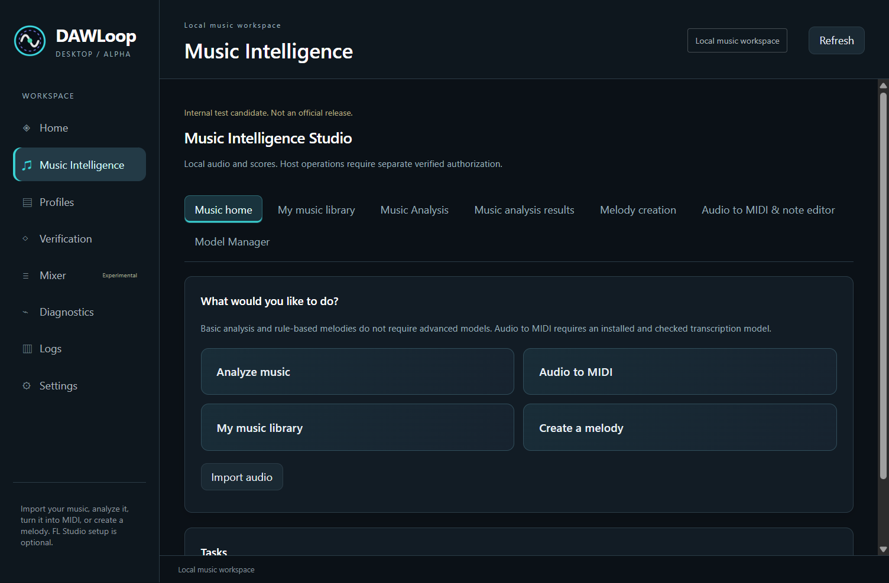


## DAWLoop Desktop — Open Source

### 一个工作区，从音乐素材到可编辑旋律

研究一段音乐的变化，或为已有和声准备旋律：Music Intelligence 把试听、分析、创作和编辑放在同一个工作区。

### 导入与分析音乐

导入自己的 WAV，试听并定位感兴趣的段落，再查看响度、能量、节奏变化和调性候选。例如，先找出伴奏开始变密的位置，再考虑旋律应该留白还是增加活动感。

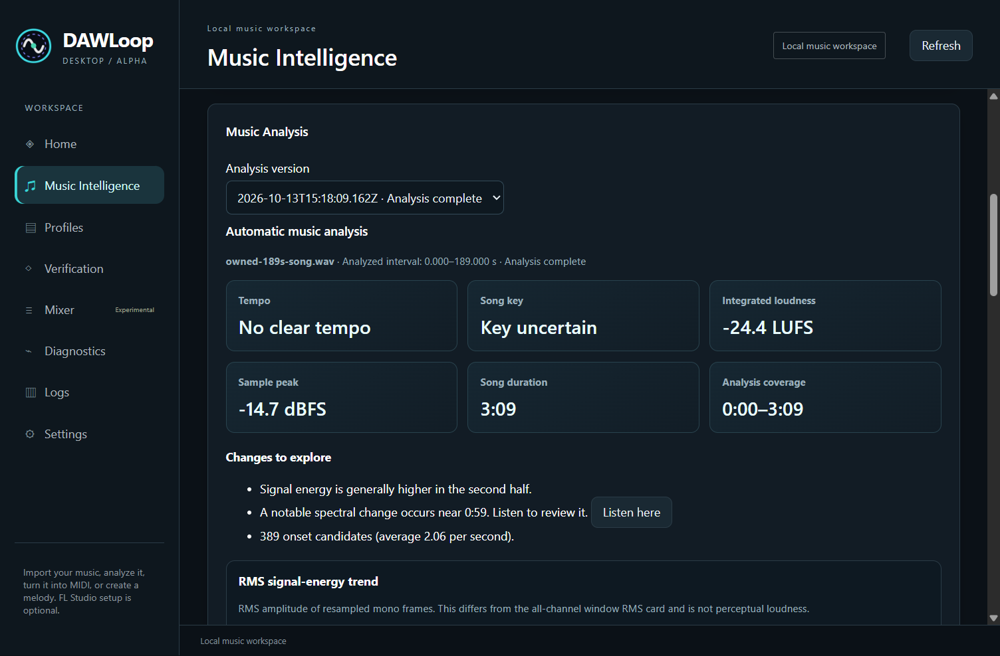

结合试听阅读分析结果，保存值得继续研究的报告，之后从列表重新打开。分析帮助你形成创作判断，节奏和调性候选供你参考。

### 创建与修改旋律

设置调性、和声、节奏、长度、密度与 Seed，创建规则辅助旋律；也可以在安装配置 Basic Pitch 后，从乐器音频转录音符。

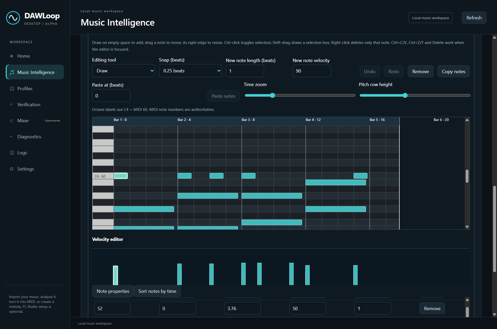

在 Piano Roll 中选择和移动音符，调整音高、起点、时值与力度，试听并撤销不合适的修改。给满意的乐谱命名保存，导出 MIDI 后继续音色与编排制作。

### 准备需要的组件

组件管理显示安装条件与可用状态。先阅读许可并确认安装，再按任务准备基础分析或 Basic Pitch 转录组件。

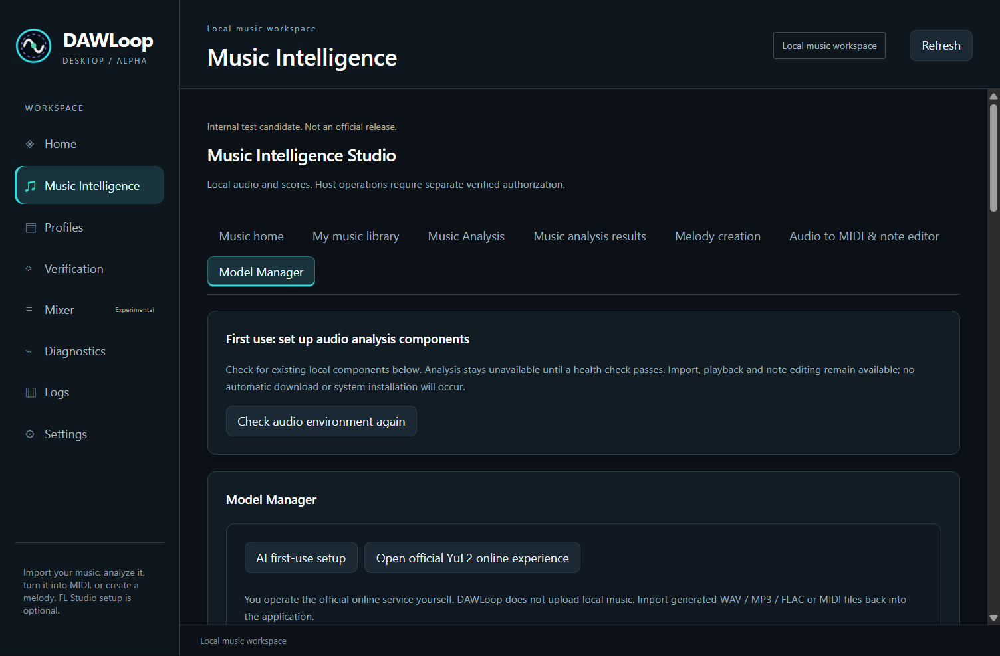

### 完整的 Desktop 工作流

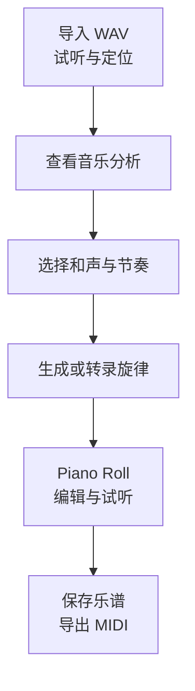
```mermaid
flowchart TD
    A[导入 WAV<br/>试听与定位] --> B[查看音乐分析]
    B --> C[选择和声与节奏]
    C --> D[生成或转录旋律]
    D --> E[Piano Roll<br/>编辑与试听]
    E --> F[保存乐谱<br/>导出 MIDI]
```

分析报告帮助你选择创作方向，具体旋律设置和编辑由你决定。可选转录与规则创作汇入同一个音符编辑工作流。

## DAWLoop Plugin — Proprietary

把参考、AI 候选与试听留在 DAW 里。Plugin 是独立闭源产品线，本轮交付面向作曲的 **Composer**。

### Composer：从参考音乐到自己的下一句

已有一段和弦，想找到更合适的旋律或另一种和声？把 MIDI 文件或 FL Studio 的官方 MIDI 剪贴板内容放入参考区，描述音乐目标，在和声画布与生成区比较候选，再将喜欢的版本带回宿主。

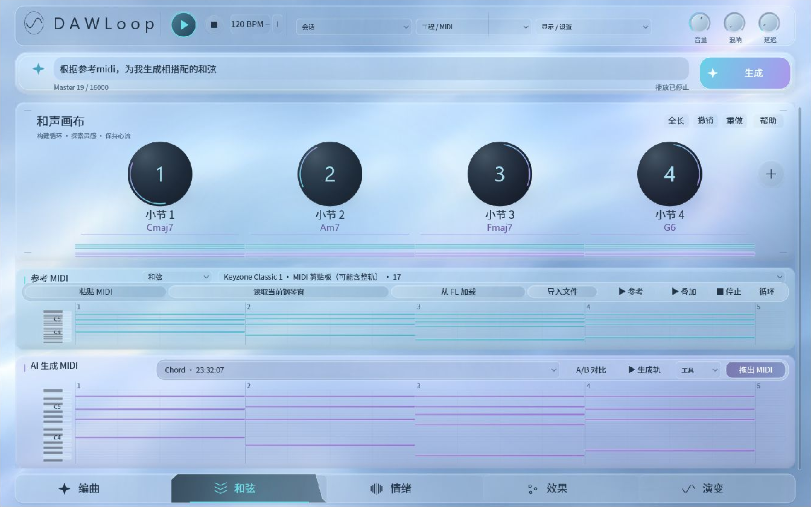

截图来自真实 FL Studio 中的开发版本；仅裁切插件工作区。当前候选默认使用采样钢琴试听。

- **带入参考**：导入标准 MIDI，或使用 Piano Roll → File → Copy to MIDI clipboard 后在插件中粘贴。参考区保留音符与和声上下文。
- **描述与比较**：选择目标和情绪，填写提示词，查看生成音符、A/B 比较及候选历史。
- **试听与调整**：独立或合并试听参考与候选，编辑和弦、音区等音乐设置，再选择保留的版本。
- **回到宿主**：导出或拖出 MIDI 到指定 Piano Roll；宿主出现导入确认时由用户接受。
- **读取宿主上下文**：可选 FL 辅助脚本提供无需保存工程的当前钢琴窗快照；名称浏览由 Controller 桥接提供。使用前核对 Pattern / Channel 与实际打开的钢琴窗，名称读取不等于音符读取。

#### AI Generation & Personalization

**你的 Agent，你的音乐方向。Your agent. Your musical direction.**

Composer 提供参考音符、音乐参数与可比较的候选工作区；生成方向取决于你接入的 Agent / 模型、提示词、参考素材及配置。已经在外部训练或微调的模型也可以成为你的接入选择，但插件本身不负责训练或微调，使用它也不要求先训练模型。

设置中可配置服务商、API 地址和模型，密钥由 Windows 凭据库保存。主动测试或生成时，提示词、参考音符及相关音乐参数会发送给所选服务商，可能产生第三方费用。也可以让自己的 Agent 连接插件，利用参考音符与音乐参数参与创作。

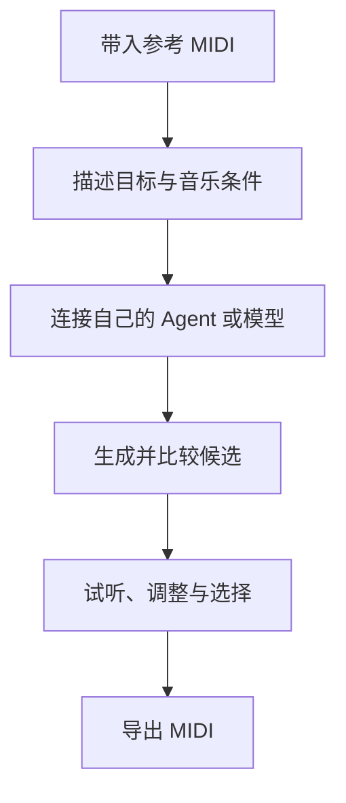
```mermaid
flowchart TD
    A[带入参考 MIDI] --> B[描述目标与音乐条件]
    B --> C[连接自己的 Agent 或模型]
    C --> D[生成并比较候选]
    D --> E[试听、调整与选择]
    E --> F[导出 MIDI]
```

### Plugin 获取方式

[下载 Composer 0.2.0-rc.1 · Windows x64 VST3](https://github.com/ryurikoneko/DAWLoop/releases/download/plugin-v0.2.0-rc.1/DAWLoop-Plugin-V2-0.2.0-rc.1-Windows-x64-VST3-r2.zip) · [发行说明与校验和](https://github.com/ryurikoneko/DAWLoop/releases/tag/plugin-v0.2.0-rc.1)

允许免费安装，用于个人及商业音乐创作；插件源码及专有二进制再分发权不随之授予。见 [二进制使用条款](https://github.com/ryurikoneko/DAWLoop/releases/download/plugin-v0.2.0-rc.1/DAWLoop-Composer-Binary-Use-Terms-0.2.0-rc.1.txt)。本轮交付 Composer 完整 Bundle，不含独立安装器或生产更新器。发行准备、可选桥接和许可说明见 [Plugin 指南](docs/PLUGINS.md)。

## DAWLoop Runtime — Open Source

Runtime 为开发者提供 Musical Grid、Note Plan、Production Pipeline、Agent 接口、执行适配与验证工具。它把音乐意图变成有明确目标和可观察结果的宿主任务。

### 让 AI 参与真实的 FL Studio 工作流

当你希望 AI 为某个乐器准备短句，任务可以从音乐意图继续进入真实宿主：DAWLoop 组织计划，核对操作目标，通过执行后端与正在运行的 FL Studio 通信，再把结果带回下一轮判断。

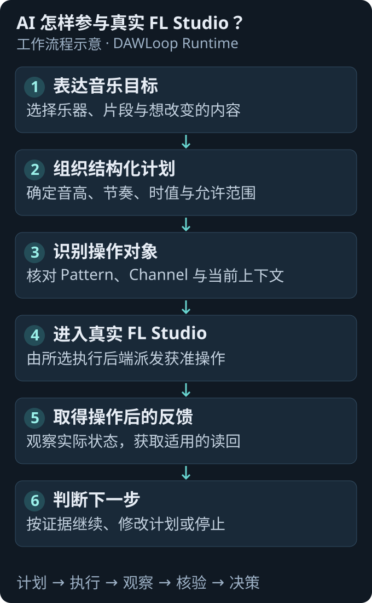

1. 描述音乐目标：明确希望改变的乐器与片段。
2. 准备音乐计划：表达音符、节奏位置、时值与允许范围。
3. 识别目标：读取并核对 Pattern、Channel 与工程上下文。
4. 执行动作：由所选后端派发获准的宿主操作。
5. 观察结果：取得实际状态及适用的读回。
6. 决定下一步：根据报告继续、修改计划或停止。

### 音符应该落在哪里？

Pattern 决定音乐片段，Channel 决定乐器。Controller 读取真实身份，Runtime 导航到已有对象，并结合界面观察核对 Piano Roll 的目标。

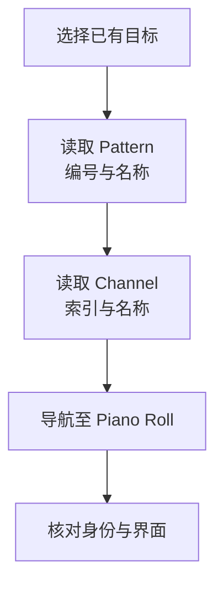
```mermaid
flowchart TD
    A[选择已有目标] --> B[读取 Pattern<br/>编号与名称]
    B --> C[读取 Channel<br/>索引与名称]
    C --> D[导航至 Piano Roll]
    D --> E[核对身份与界面]
```

### 谁把操作送进 FL Studio？

Community FL Studio MCP 提供 transport、Channel、Piano Roll、Mixer 与已加载插件参数等工具。DAWLoop 补充音乐计划、目标管理和结果核验。Native Gopher 是另一条执行路径；Controller 的身份与导航为目标准备提供支持。

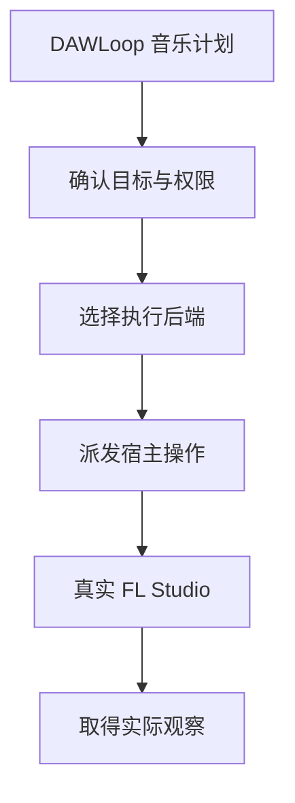
```mermaid
flowchart TD
    A[DAWLoop 音乐计划] --> B[确认目标与权限]
    B --> C[选择执行后端]
    C --> D[派发宿主操作]
    D --> E[真实 FL Studio]
    E --> F[取得实际观察]
```

Controller 负责身份与导航；实际操作按所选 Community 或 Native 后端进入宿主。[完整后端架构](docs/FL_STUDIO_MCP.md#execution)保留各条路径及其边界。

### 执行与反馈怎样衔接？

下面用 Native 流程说明消息顺序：先明确任务与目标，再派发操作；用户审阅宿主预览，随后取得完成信息与实际观察。

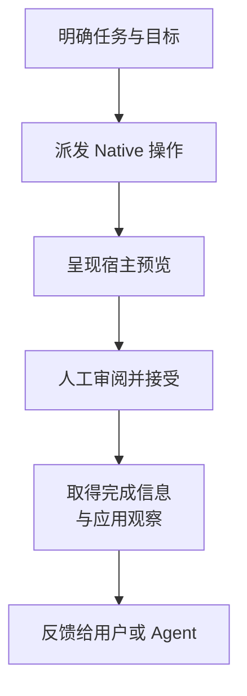
```mermaid
flowchart TD
    A[明确任务与目标] --> B[派发 Native 操作]
    B --> C[呈现宿主预览]
    C --> D[人工审阅并接受]
    D --> E[取得完成信息<br/>与应用观察]
    E --> F[反馈给用户或 Agent]
```

[完整消息时序](docs/FL_STUDIO_MCP.md#native-sequence)说明各参与方的交互。

### 观察之后，怎样决定继续？

工具回执描述执行情况；实际读回用于核对音乐目标。取得完整音符事件时，Exact-Set 比较起点、时值、音高、力度与重复次数，输出 PASS / STOP；其他观察按对应操作规则形成报告。

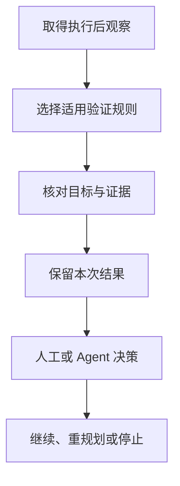
```mermaid
flowchart TD
    A[取得执行后观察] --> B[选择适用验证规则]
    B --> C[核对目标与证据]
    C --> D[保留本次结果]
    D --> E[人工或 Agent 决策]
    E --> F[继续、重规划或停止]
```

### 真实 FL Studio 写入测试

DAWLoop 已在真实 FL Studio 中完成受控音符操作的现场测试，涵盖目标确认、操作派发、人工接受及执行结果观察。

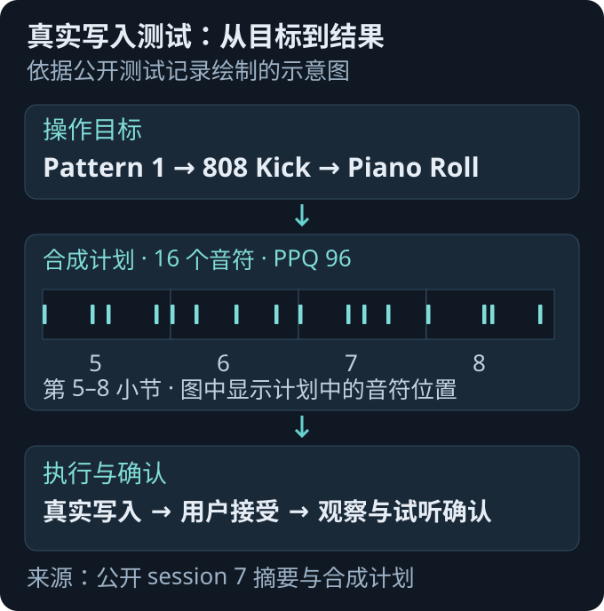

示意图依据公开测试记录与合成计划绘制。真实流程与实现分别见 [操作故事](docs/DEMOS.md)、[公开记录](evidence/public/fast_session_7.json) 和 [执行原理](docs/FL_STUDIO_MCP.md)。

## 三种产品，怎样一起工作？

Desktop 适合离开宿主研究素材、创建和编辑 MIDI；Composer 把参考、生成与试听放进宿主；Runtime 则让开发者扩展计划、后端与验证规则。你可以独立使用其中一条路径，也可以通过 MIDI 文件、剪贴板和明确的宿主操作衔接制作。

Brain 是 Runtime 的音乐计划与规则，Hands 是宿主执行后端，Ears 是 Production Pipeline 的分析与测量。这是职责划分，不表示三个产品已经无缝自动同步。

## 为什么把这些能力放在一起？

- 从计划到操作：把音乐意图组织为明确任务，通过后端进入真实 DAW。
- 从操作到核验：结合目标、执行信息与实际观察，判断下一步。
- 从分析到编辑：在 Desktop 中创作和修改，用 Runtime 扩展 Agent 工作流。

[架构解释](docs/ARCHITECTURE.md) · [Production Pipeline](docs/PRODUCTION_PIPELINE.md) · [功能与源码](docs/CAPABILITIES.md)

## 开始使用

### 音乐创作者：下载 Desktop

[Windows x64 便携版 ZIP](https://github.com/ryurikoneko/DAWLoop/releases/download/v0.5.6-alpha.2/DAWLoop%2B0.5.6-alpha.2-Windows-x64-Portable.zip) · [发行说明与校验和](https://github.com/ryurikoneko/DAWLoop/releases/tag/v0.5.6-alpha.2)

程序未签名。运行前核对官方来源和 `SHA256SUMS.txt`，保留系统安全保护；升级前备份用户数据。

1. 解压完整程序目录并运行 `DAWLoop.exe`。
2. 在 Music Intelligence → 组件管理阅读许可，确认安装基础组件；需要转录时再安装 Basic Pitch。
3. 导入 WAV，试听与分析，或创建旋律进入 Piano Roll，保存并导出 MIDI。

[Desktop 使用指南](docs/DESKTOP.md) 按界面展开每一步，无需安装系统 Python、Node 或 Codex。

### 开发者：先运行 Runtime 例子

Python 3.11+。以下例子使用合成数据，生成分析、profile 与音乐计划：

```powershell
git clone https://github.com/ryurikoneko/DAWLoop.git
cd DAWLoop
python -m venv .venv
.\.venv\Scripts\python.exe -m pip install -e ".[learning]"
.\.venv\Scripts\python.exe learning/examples/generic_learning/run.py --output workspace/personal/demo-v1
```

Linux/macOS 使用 `python3 -m venv .venv` 和 `.venv/bin/python`。每次选择尚不存在的输出目录。

[Quickstart](docs/QUICKSTART.md) · [FL Studio 设置](docs/FL_STUDIO_SETUP.md) · [贡献](CONTRIBUTING.md) · [路线图](docs/ROADMAP.md)

## 开源与致谢

Desktop、Runtime 与本公开仓库的项目自有开源代码采用 [MIT 许可证](LICENSE)。Plugin 私有实现保持闭源，二进制按独立的 [免费使用条款](https://github.com/ryurikoneko/DAWLoop/releases/download/plugin-v0.2.0-rc.1/DAWLoop-Composer-Binary-Use-Terms-0.2.0-rc.1.txt) 分发；根 MIT 不覆盖未公开的 Plugin 实现。品牌与部分图像的独立声明见 [品牌政策](TRADEMARKS.md)、[许可范围](LICENSE_POLICY.md) 和 [媒体说明](docs/media/README.md)。

感谢 [karl-andres/fl-studio-mcp](https://github.com/karl-andres/fl-studio-mcp) 的社区 FL Studio 控制工作，以及 Bilibili 创作者 [坏影子不坏](https://space.bilibili.com/599132499)（UID 599132499）的 [DSH 工作流展示](https://www.bilibili.com/video/BV1PTht6cENP/)。其制作实践启发 Production Pipeline；部分通用分析代码改编自其提供的 MIT 许可 `whale-music-pipeline`，保留原作者通知。

[完整致谢](docs/ACKNOWLEDGEMENTS.md) · [第三方通知](THIRD_PARTY_NOTICES.md) · [来源](PROVENANCE.md) · [安全](SECURITY.md) · [术语](docs/GLOSSARY.md)

## 当前版本说明

- Plugin **Composer 0.2.0-rc.1** 已公开预发行，仅含 Composer，采用独立闭源二进制条款，不自动安装更新。
- Desktop **0.5.6-alpha.2** 是公开 Windows x64 Pre-release；维护者环境已有运行记录，独立干净 Windows 兼容性仍待确认，程序未签名。
- 基础分析支持 WAV；Basic Pitch 可在确认许可后安装，适合乐器素材，转录结果需要音乐审阅。
- Desktop 与 Python Runtime 分别交付；本文宿主图说明工作模式，具体 FL 现场范围以固定测试记录和 [验证文档](docs/VERIFICATION.md) 为准。
- 通用自主制作、任意工程连续控制及完整自动混音属于 [后续方向](docs/ROADMAP.md)。
- 截图来自此前开发版本；Desktop 源码见 [Alpha.2 标签](https://github.com/ryurikoneko/DAWLoop/tree/v0.5.6-alpha.2)，Runtime 在 main。更新提示仅按版本、渠道与维护者批准匹配，不自动安装。
