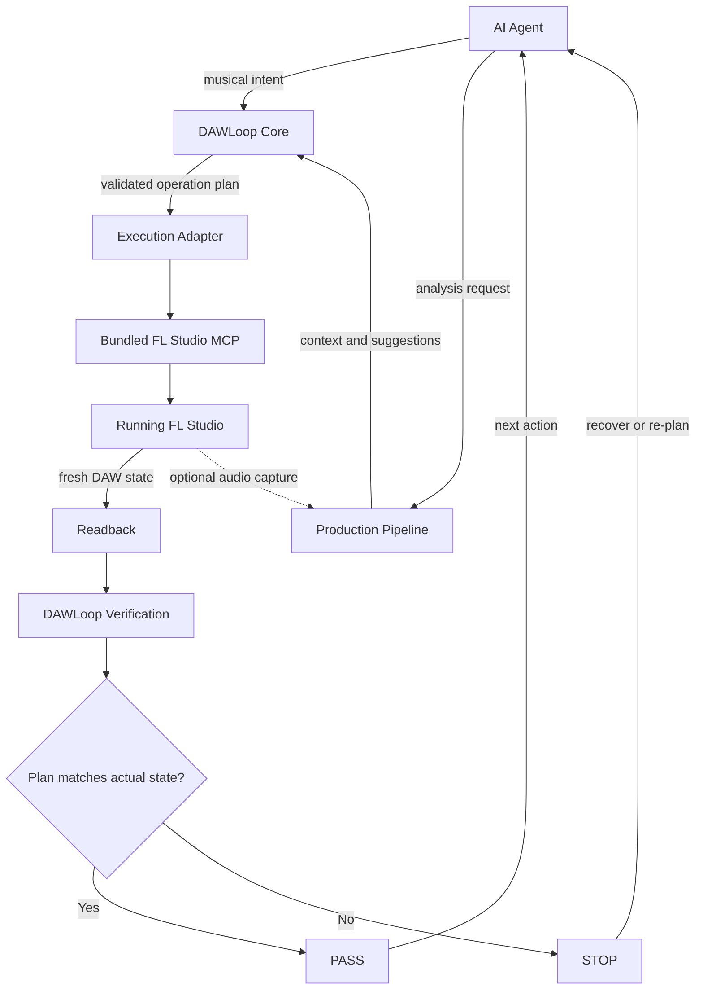

# Architecture

DAWLoop combines three layers for agent-directed music work: the **Hands** that operate a DAW, the **Brain and Rules** that structure and verify operations, and the **Ears / Production Assistance** that analyze musical and audio context.



## Hands: FL Studio Execution Backend

The current execution path combines a DAWLoop-specific adapter with the pinned Community FL Studio MCP snapshot in `third_party/fl-studio-mcp/`. The backend exposes control domains including transport, Channel and Pattern interactions, Piano Roll note operations, note-state readback, Mixer state and routing, and access to parameters on loaded plugins.

The upstream project documents that it cannot programmatically create new Patterns or load new plugins. The user must prepare those targets in FL Studio.

A maintainer-reported real FL Studio integration run has exercised the path. The setup may be unstable across environments, and real-world user testing feedback is welcome. The run's target identity and machine-readable note readback evidence are not archived here, so this report is not a reproducible Live Verified result.

## Brain and Rules: DAWLoop Core

The Core is independent of a specific DAW runtime. `MusicalGrid` resolves bar / beat / tick positions to integer absolute ticks. `NotePlan` validates target, section bounds, pitch, velocity, and event duration. The Exact-Set verifier compares planned and actual events while preserving duplicate counts and diagnosing missing, extra, and mismatched fields.

The in-memory event store supports offline tests only. `Offline Algorithm Verified` is not `FL Studio Verified`.

## Ears / Production Assistance: Production Pipeline

The Production Pipeline lives under `src/dawloop/production/` and is optional. Its purpose is to inspect musical/audio material and help the agent choose a useful next operation; it does not replace execution or verification.

- `smf.py`: dependency-free Standard MIDI File parsing and note-density window selection;
- `orchestration.py`: register-aware phrase assignment, pitch-band gap detection, and source-note coverage checks;
- `mix.py`: active-frame RMS, measured fader calibration, and calibration-aware fader planning;
- `loopback.py`: optional Windows WASAPI loopback capture;
- `sf2.py`: optional SoundFont parsing and offline audition.

A typical future mixer loop is:

```text
loopback capture
→ active-frame RMS
→ choose target/correction
→ calibration-aware fader plan
→ FL Studio write
→ mixer readback
→ compare actual value/state
→ PASS / STOP
```

The first four steps can inform a plan but do not establish a DAW operation's PASS.

## Execution, Readback, and Verification

The adapter boundary keeps DAWLoop Core independent of a specific control route. The current tree contains a DAWLoop adapter for the pinned Community FL Studio MCP snapshot. Native Computer Use, DAWLoop SysEx RPC, compatibility bridges, and other DAW adapters remain future options.

The adapter maps validated Note Plans to upstream Piano Roll operations, checks the selected Channel and blank-target preconditions, requests fresh Piano Roll state, converts returned notes into DAWLoop events, and produces a structured execution report. The adapter also contains Mixer discovery and loaded-plugin parameter query paths. These implementations and upstream capabilities are not live-verified merely because the code is present.

The upstream Piano Roll readback does not include Pattern identity. DAWLoop's primary FL Studio Controller adds a read-only identity action over the same MIDI-trigger / JSON request-response path used for upstream controller RPC, reporting project title, Pattern number and name, global Channel index and name, PPQ, `safeToEdit`, and available API / FL versions. It does not add a second Controller or transport. Piano Roll note operations remain a distinct upstream path using a request JSON file, the `ComposeWithLLM` script, and a `pynput` hotkey trigger. Identity capability is implemented but still requires live loading and response verification; it must not infer Pattern identity from Piano Roll data.

```text
validated plan
→ execution adapter
→ running FL Studio
→ fresh state readback
→ compare actual state with plan
→ PASS / STOP
```

An adapter success response, a calculated fader target, an audio-analysis result, or an interface screenshot is not proof of the resulting DAW state.

## Agent Loop and Safety

DAWLoop is designed for tool-using agents through structured inputs and machine-readable reports. This does not mean every agent is already integrated or that music production is autonomous. An agent can use Production Pipeline analysis to shape a plan, submit the plan to Core validation, call an execution adapter, observe the readback and verification result, and then continue or re-plan. This iterative agent decision closes the loop; it does not make unverified state safe to use.

On `STOP`, the agent should report the failure and avoid building further operations on an unverified state. Analysis suggestions cannot be promoted to PASS without fresh DAW readback.

## Third-Party Boundaries

`third_party/fl-studio-mcp/` is a fixed third-party source snapshot of Community FL Studio MCP. DAWLoop-specific code lives separately in `src/dawloop/adapters/fl_studio_mcp/`.

Production Pipeline files adapted from `whale-music-pipeline` retain their original MIT license at `third_party/whale-music-pipeline/LICENSE` and remain classified as `ADAPTED_FROM_THIRD_PARTY` in provenance records.

See [FL Studio MCP integration](FL_STUDIO_MCP.md), [Production Pipeline](PRODUCTION_PIPELINE.md), [Acknowledgements](ACKNOWLEDGEMENTS.md), [Provenance](../PROVENANCE.md), and [Third-Party Notices](../THIRD_PARTY_NOTICES.md).
