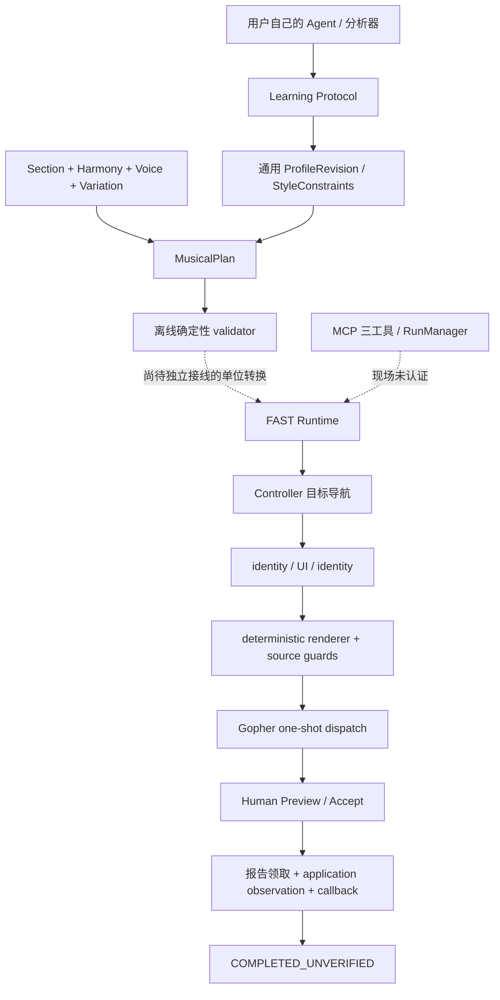

# Architecture

DAWLoop 分为音乐合同、学习接口、执行Runtime与证据层。个人数据在Git忽略的workspace/profile目录；Core不关心参考艺术家或资料来源标签。

## 音乐合同与学习

`src/dawloop/music_plan.py` 保存Section Brief/Harmony/Voice/Variation与乐句、动机解释结构；参考生成器当前单声部、4/4、最多8小节、受限16-note离线计划。`src/dawloop/learning/` 保存唯一四份Schema与来源/统计/profile版本合同；用户自己的Agent或外部分析器负责实际提取，Core不提供内置艺术家学习库。

`src/dawloop/production/` 提供SMF、orchestration、RMS、loopback、SF2辅助。算法中的音域/源覆盖等通用逻辑与第三方来源分别登记，分析建议不产生DAW写入认证。

## Runtime FAST

`FastMusicRuntime`组合既有Native write backend，不接受任意source。完整输入先校验，再Controller导航与观察确认，deterministic renderer输出source，source/AST/hash/target/generation/one-shot journal守卫控制派发。人工接受、应用观察、回调彼此独立。

当前导航固定三个primitive，全局channel index从入口到独占选择/回读/定向event id一致。一次事务允许这些有限动作，UNKNOWN仍消耗预算；不得重试或替换方法修复。Piano Roll标题与Controller选择可能不同，所以`showWindow`不承担定向绑定。

Controller build、session、project generation与Gopher page target、host generation、bridge epoch各自承担不同代次约束。project_title描述可空，不参与唯一身份；运行时build由Controller报告，不从磁盘注入。

## 观察和报告

observer绑定原始图像payload/hash、真实capture调用区间、request/operation/generation，并在identity夹读内提交新鲜证据。自动采样不等于内容确认；Agent视觉回执必须来自实际图像，不从expected填目标。

HumanReport使用唯一run/session/report。先persist再claim；REALTIME必须有实际领取，LATE只追加证据，不改immutable terminal。应用观察同样分produced/persisted/claimed/confirmed；跨clock domain不直接减monotonic时间。取消、迟到隔离与有界teardown保留。

## MCP候选入口

`fast_mcp_server.py`只公开三工具；RunManager持有后台事务。operation_id是调用幂等身份，run_id是执行实例，session_id是证据会话。MCP和observer采用真实factory组合现有FAST，不另造执行器。缺少Controller/Gopher/observer/预算时NOT_READY。

stdio常驻不等于桥接复用；当前bridge每run关闭。MCP现场路径暂停于外部browser page identity，不能用连接端口替代真实UI身份。连接复用、normal project与连续预算是之后独立阶段。

## VERIFIED与Community边界

离线`verification/`按多重集合比较事件，保留重复计数。Community backend固定快照位于`third_party/fl-studio-mcp/`，DAWLoop adapter独立；上游缓存及能力不自动构成本项目fresh producer readback认证。

Native FAST返回COMPLETED_UNVERIFIED；当前无可认证producer notes[]，Native VERIFIED冻结。未来add-only验证必须比较baseline+planned additions而非只比较plan，且锁定PPQ/request/实际读取对象。参见[验证规则](VERIFICATION.md)、[来源](../PROVENANCE.md)、[第三方通知](../THIRD_PARTY_NOTICES.md)。
