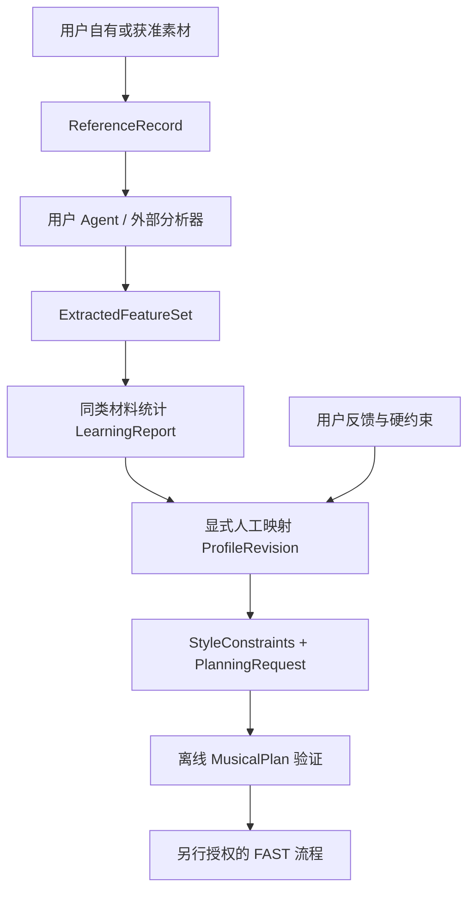

<!-- SPDX-License-Identifier: MIT -->
<!-- SPDX-FileCopyrightText: 2026 ryurikoneko -->

# 让自己的 Agent 学习音乐偏好

[KNOWN｜HIGH] 本目录提供协议、提示模板、验证器和合成练习。它不包含艺术家知识库、自动音频转录器或模型权重训练器。首版“学习”是从用户自己的素材形成有证据、可修订的偏好数据。合法计划不等于好听，离线检查不等于现场写入认证。



## 先跑合成例子

[KNOWN｜HIGH] 在仓库根目录执行以下命令；输出目录必须是新的。示例全部由合成音符构成，反馈标为 `SYNTHETIC_EXAMPLE / VISUAL_REVIEW_ONLY`，没有虚构试听批准。

```powershell
python -m pip install -e ".[learning]"
python learning/examples/generic_learning/run.py --output workspace/personal/demo-v1
```

[KNOWN｜HIGH] 输出包含原始合成材料 `references/` 以及 `references.json`、`analyses.json`、`report.json`、`profile_v1.json`、`profile_v2.json`、`request.json`、`plan.json`；仓库的 `learning/examples/generic_learning/expected/` 提供同一计算的完整参考输出。脚本既不导入宿主执行器，也不派发音符。计划仍受现有 4/4、单声部、最多 8 小节和 16 音符的离线约束；这里没有扩展 FAST 的现场认证范围。

## 建立个人工作区

```text
workspace/personal/<workspace_id>/
  references/       用户素材及ReferenceRecord
  analyses/         每个来源的分析与证据
  reports/          统计、例外、冲突和留出审阅
  feedback/         对具体plan/profile的用户反馈
  knowledge/        自写操作笔记及获准本地文档索引
profiles/personal/<workspace_id>/
  profile-v1.json
  profile-v2.json
```

[KNOWN｜HIGH] 这两个个人目录已被 Git 忽略。先执行 `git check-ignore <实际文件>`；已被跟踪的文件不会因为忽略规则自动退出 Git。公开贡献只使用合成或明确获准发布的材料。

## 八步学习路径

1. [INFERRED｜HIGH] **限定问题。** 先选一个声部、段落与用途，例如“克制的单声部主歌句”。不要把整曲混音特征直接解释成某个声部的规律。
2. [INFERRED｜HIGH] **登记素材。** 每份材料填来源 ID、独立作品 ID、相对本地路径、原始文件字节 SHA-256 与权限说明。`rights_status` 是使用者的声明，不是系统已核实的授权。权限未知的材料不参与推导。一个作品的重复片段不能算多首独立作品。
3. [INFERRED｜HIGH] **按模板分析。** 使用 [analyze_reference](prompts/analyze_reference.md)。用户 Agent 必须写出实际能访问的输入；有可靠音符数据才计算音高、音程、和弦音和 velocity。音频分离/转录推测标为 `inferred`；不能判断则 `value=null`、`method=unknown`、说明原因，不填零。
4. [INFERRED｜HIGH] **比较同类材料。** 使用 [compare_references](prompts/compare_references.md)，运行 `aggregate_features` 后 `validate_bundle`。统一 role、section、meter、单位和定义；observed/inferred 分桶。报告保留 count、coverage、范围、标准差和样本值。解释性结论另写带证据的审阅记录，分别列稳定假设、偶发、单曲特例和冲突，不修改计算统计。
5. [INFERRED｜HIGH] **人工映射旋钮。** 使用 [derive_profile](prompts/derive_profile.md)。四个控制参数分别写数值、参考特征和理由。首版只支持 `manual-review-v1`，不假装已有统计到生成器的校准模型。密度、音域等进入独立 `PlanningRequest` 硬约束，不偷偷塞进 profile。
6. [INFERRED｜HIGH] **做离线对照。** 使用 [validate_profile](prompts/validate_profile.md)，再调用现有音乐计划验证器。保留未参与 profile 推导的材料做人工留出检查：检查是否只记住训练素材、是否有相反例子。程序目前只登记留出，`holdout_result=NOT_EVALUATED`；没有自动评估模型，不能填“通过”。少样本偏好是暂定假设。
7. [INFERRED｜HIGH] **收集真实用户反馈。** 反馈绑定 plan hash 与 profile hash，记录只看谱还是已试听，明确要改哪个旋钮。不要把 Agent 猜测写成 `USER_REPORTED / LISTENED_OK`。用户不喜欢参考曲的高音域时，调整请求的音域；不能因此改写参考曲的客观分析。
8. [INFERRED｜HIGH] **产出新版本。** `revise_profile` 留存父版本 hash、反馈 ID 和具体变更，`write_revision` 排他创建新文件。验证父文档并保留旧版，比较固定请求的前后结果，必要时回到旧版本。不是一次分析后永久定型。

## 四份合同与调用边界

[KNOWN｜HIGH] Schema 的唯一实现位置是随 Python 包安装的 [schemas](../src/dawloop/learning/schemas/)；没有第二份副本需要同步。四份 schema 均拒绝额外字段，并使用固定 v1 标识。

| 合同 | 作用 | 程序之外仍需确认 |
| --- | --- | --- |
| `reference_track` | 来源、独立作品、字节 hash、权限声明 | 原始文件与声明真实，许可允许实际用途 |
| `extracted_features` | 定义/单位/方法/置信度/证据/缺失原因 | 分析器真的读过所指材料，声部与和弦标签可信 |
| `learning_report` | 样本清单、缺失/排除、分布、留出 | 稳定共性、例外、冲突与泛化的人工判断 |
| `style_profile` | 四个旋钮、映射理由、父版本和反馈 | 用户偏好真实，参数适合任务 |

```python
from dawloop.learning import (
    aggregate_features, validate_bundle, build_profile, validate_profile,
    revise_profile, write_revision,
)

report = aggregate_features(references, analyses, group_id="my-group",
                            holdout_source_ids=("held-out-source",))
validate_bundle(references, analyses, report)
profile = build_profile(report, profile_id="my-profile", decisions=decisions)
style = validate_profile(profile, report=report)
# 把style赋给PlanningRequest.style_constraints；不把整个学习报告交给Runtime。
```

[KNOWN｜HIGH] `decisions` 要为四个字段各提供 `value`、`feature_names`、`reason`；没有默认从统计中猜参数的路径。来源标签/艺术家名称不会触发生成器分支。摘要能检查文档关联及改动，不能验证署名或分析内容真伪。

## v1 特征计量定义

[KNOWN｜HIGH] `definition_version=dawloop-feature-v1` 使用下表。scope 必须对应实际分析片段；未明确的节拍、和弦或对齐方式应标 unknown，不用风格常识补齐。

| name / unit | 定义 |
| --- | --- |
| `note_density / notes_per_bar` | 当前声部范围的起音数除以分析小节数，重复音符按次数计 |
| `register_center / midi_number` | 当前声部音符 MIDI 音高的算术平均，不按时值加权 |
| `mean_abs_interval / semitones` | 按起音排序的单声部相邻音高绝对差均值；不足两个音或声部不明为 unknown |
| `offbeat_ratio / ratio` | 起音不落在整数四分音符拍点的音符比例；需要已知 PPQ 与拍点原点，不是完整切分强度模型 |
| `tension_ratio / ratio` | 起音时非当前和弦音的音符比例，必须有对应和弦标注 |
| `motif_change_ratio / ratio` | 等长、等音符数、同序对齐的原型/变奏中 pitch/start-relative/length 任一变化的比例；未对齐为 unknown |
| `tempo / beats_per_minute` | 当前固定速度范围内的四分音符 BPM；变速片段不拿单个值替代速度曲线 |
| `phrase_length / bars` | 已标注句长的小节数均值 |
| `mean_velocity / midi_1_127` | MIDI note-on velocity 均值；音频响度不能冒充 MIDI velocity |

[KNOWN｜HIGH] 当前参考生成器的 `rhythm_syncopation` 控制有限的弱拍位移，`melody_leap_tendency` 影响跳进偏好，`harmony_tension_usage` 影响合法 tension 候选排序，`motif_variation_strength` 缩放已有变奏预算。这四个旋钮都是偏好，不等于表中测量量；硬约束始终优先。

## 官方操作知识与 FLaiK HTML

[KNOWN｜HIGH] 操作手册用于核对 API、窗口与命令语义，不能替代音乐素材分析。FLaiK 打包官方 HTML 不证明它拥有再许可权；本项目不复制其手册、图片或代码，也不提供批量抓取器。官方条款包含内容使用限制和链接通知要求，不能仅凭文件可访问就推断允许再分发、上传到外部模型或训练。[官方条款](https://www.image-line.com/disclaimer)。

[INFERRED｜HIGH] 用户可以先核对自己的许可与实际用途，在本地按获准方式查阅；个人知识索引只记录 `source_label / source_id / local_ref / content_hash / rights_status / topic / checked_at` 等元数据与自写笔记。不要把整页 HTML 转成 Markdown/embeddings 后当成自己的公开资产。公共仓库只提供这一使用规范与自写适配逻辑；网页全文、云端输入、商业使用和发布链接的授权分别核对。

## 下一阶段边界

[KNOWN｜HIGH] 本轮只认证离线合同。用户 Agent 可以按本流程建立自己的偏好，但新 profile、离线旋律和新增数据不自动取得现场认证。MCP 浏览器依赖暂停、VERIFIED 冻结、Auto Accept 延期、连接复用未测试的现状不变。
